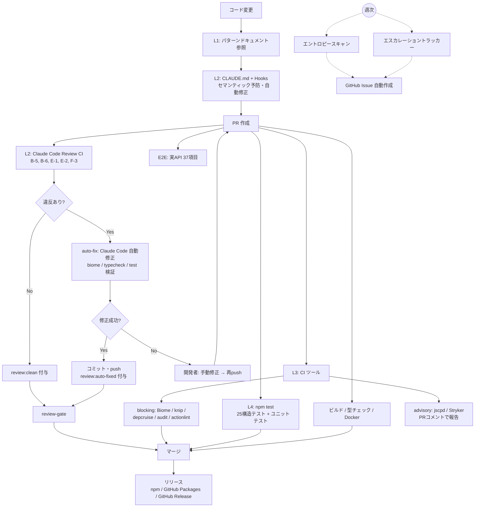
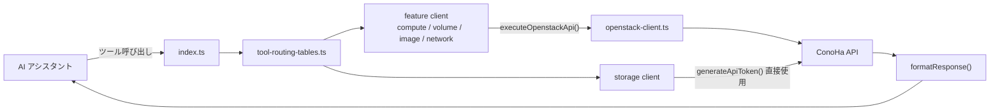

# 開発者ガイド — ハーネスエンジニアリング施策

本プロジェクトでは **ハーネスエンジニアリング** の考え方を採用し、AIコーディングエージェントの出力品質を構造的に担保している。
ドキュメント → AIスキル → CI → テストの4段階で段階的にルールを執行し、品質の「手綱（harness）」を握る。

### 何を担保しているか

- **コード構造の一貫性** — ファイル配置（feature/ディレクトリ）、命名規約（kebab-case / camelCase / PascalCase）、アーキテクチャ境界（feature間インポート禁止）
- **実装パターンの統一** — API呼び出しチェーン（`executeOpenstackApi()` → `formatResponse()`）、レスポンスフォーマット、エラーハンドリング（`formatErrorMessage()`）
- **テスト品質** — モックパターン（`vi.mock()` / `vi.mocked()`）、カバレッジ、ミューテーションスコア
- **コード衛生** — 未使用コード排除（knip）、重複排除（jscpd）、セキュリティ脆弱性検出（npm audit）、循環依存検出（dependency-cruiser）
- **ドキュメント整合性** — CLAUDE.md・パターンファイル・ESCALATION.md間のルールID一致を自動検証

### どうやって担保しているか

- **L1（ドキュメント）**: 16のパターンファイル（`harness/patterns/*.md`）にルールを定義し、開発者・AIの参照元とする
- **L2（AIセマンティック）**: `CLAUDE.md` に5つのセマンティックルールを明記し開発時に予防 + Claude Code Review CI でPR時に自動検知
- **L3（CIツール）**: Biome / dependency-cruiser / knip / npm audit / actionlint 等で機械的に強制（PRマージをブロック）
- **L4（構造テスト）**: `architecture.test.ts` で25のアーキテクチャ不変条件を `npm test` で検証
- **エントロピースキャン（週次）**: パターン鮮度劣化・依存関係変化等のドリフトを検出し、GitHub Issue を自動作成

---

## 1. エスカレーションラダー（4段階モデル）

違反の頻度・検出可能性に応じて執行レベルを段階的に引き上げる。

- **L1 — ドキュメント**: パターン定義のみ。すべてのルールの出発点
  - `harness/patterns/*.md`（16ファイル）に記述
- **L2 — AIセマンティックチェック**: 機械的チェック不可のセマンティックルール（5ルール）
  - `CLAUDE.md` に明記 → 開発時にClaude Codeが自動的に遵守（予防）
  - `.claude/hooks/l2-semantic-check.sh` → Edit/Write時にadvisoryチェック（B-5, B-6, E-2, F-3）
  - `claude-code-review.yml` → PR時にClaudeが自動検知（検知）
  - `coding-pattern-check` スキル → 手動でも実行可能
- **L3 — CIルール**: 3回以上検出され自動検出可能なルールを昇格
  - Biome（`useImportType`, `useNodejsImportProtocol` 含む） / dependency-cruiser / knip / jscpd / npm audit / actionlint / Stryker
- **L4 — 構造テスト**: アーキテクチャ不変条件を自動テストで保証
  - `src/architecture.test.ts`（Vitest）で25ルールを検証

**ルール体系**: 13カテゴリ・48ルール（Biome含む）

| カテゴリ | 内容 | ルール数 |
|---------|------|---------|
| A | ファイル構造 | 3 |
| B | クライアントモジュール | 6 |
| C | スキーマ | 4 |
| D | レスポンスフォーマッター | 5 |
| E | テストファイル | 6 |
| F | JSDoc | 3 |
| G | インポートルール | 4 |
| H | 命名規約 | 4 |
| I | アーキテクチャ境界 | 5 |
| J | コード衛生 | 2 |
| K | セキュリティ・品質 | 3 |
| L | ドキュメント整合性 | 3 |

詳細: `harness/ESCALATION.md`

---

## 2. パターンドキュメント

### harness/patterns/（16ファイル）

各ファイルは YAML frontmatter（`id`, `title`, `enforcement-level`, `related-rules`, `checked-by`）で管理。

- `architecture-layers.md` — アーキテクチャ境界ルール（feature間インポート禁止等）
- `file-structure.md` — ディレクトリ構成、テストファイル配置ルール
- `client-module.md` — `executeOpenstackApi()` → `formatResponse()` チェーンパターン
- `schema.md` — Zod v4 スキーマ定義（`.strict()` 必須、`.describe()` 日本語）
- `response-formatter.md` — レスポンスフォーマッター実装パターン
- `type-definitions.md` — パス型・共通型の定義規約
- `routing-tables.md` — `Record<PathType, Handler>` 構造のルーティング定義
- `test-patterns.md` — Vitest テスト構造（vi.mock / vi.mocked / beforeEach）
- `naming-conventions.md` — kebab-case（ファイル）、camelCase（関数）、PascalCase（型）
- `jsdoc.md` — `@packageDocumentation` 必須、日本語 JSDoc
- `error-handling.md` — `formatErrorMessage()` による統一エラーフォーマット
- `tool-registration.md` — `server.registerTool()` パターン
- `path-addition.md` — 新パス追加時の3ファイル同時更新手順
- `import-rules.md` — ソース `.js` 拡張子あり / テスト `.js` なし
- `biome-rules.md` — Biome 設定と適用ルール
- `taste-invariants.md` — 主観的品質基準（APIレスポンス設計・エラーメッセージ・関数設計）

### harness/decisions/（KDR: 知見決定記録）

- `KDR-0001` — エスカレーションラダー導入の経緯と設計
- `KDR-0002` — L4テストスコープの選定基準
- `KDR-0003` — CODING_PATTERN.md（681行）を14ファイルへ分割した理由
- `KDR-0004` — L3ツールスイート導入（blocking/advisory分類、エントロピー管理）
- `KDR-0005` — L2セマンティックルールの昇格基準
- `KDR-0006` — ハーネスエンジニアリング全体レビュー
- `KDR-0007` — L2→L4昇格ラウンド2（B-4, D-5, H-4の昇格判断）
- `KDR-0008` — L2→L3エスカレーション自動トラッカー

---

## 3. Claude Code Hooks

`.claude/settings.json` に定義されたフック群で、開発時の品質ガードレールを提供する。

### PreToolUse（ツール実行前）

| フック | 対象 | 動作 |
|--------|------|------|
| `harness-guard.sh` | Edit\|Write | `harness/` 配下のファイル編集時にadvisory警告 |
| `lockfile-guard.sh` | Edit\|Write | `package-lock.json` の直接編集をブロック（`npm install` を案内） |
| `dangerous-cmd-guard.sh` | Bash | 危険コマンド（`rm -rf /`, `git push --force`, `git reset --hard` 等）をブロック |

### PostToolUse（ツール実行後）

| フック | 対象 | 動作 |
|--------|------|------|
| `biome-autofix.sh` | Edit\|Write | `.ts` / `.json` ファイル編集後にBiome自動修正 |
| `l2-semantic-check.sh` | Edit\|Write | L2セマンティックルール違反検知（B-5, B-6, E-2, F-3）、advisory のみ |

### Stop（セッション終了時）

| フック | 動作 |
|--------|------|
| transcript-validation（prompt型） | `.ts` 変更時にtypecheck/test実行確認、`harness/` 変更時にKDR作成検討確認 |

---

## 4. Claude Code Skills

### conoha-vps-mcp-test（E2Eテスト）

- ConoHa VPS APIの全機能37項目を一括テスト
- Group A〜S の順序付き実行（リソース作成→操作→削除の依存関係を考慮）
- GitHub Actions（`e2e-test.yaml`）で Claude Code action 経由で自動実行
- テスト結果を Markdown レポートとして出力

### coding-pattern-check（パターン準拠チェック）

- `harness/patterns/*.md` のルールに基づきソースコードをセマンティックにチェック
- 対象ファイルを4グループに分類し、Sub-Agent を並列起動して効率的に検証
- ERROR（必須修正）/ WARN（推奨修正）の2段階で報告
- L4ルールは `architecture.test.ts` で検証済みのためスキップ可能

---

## 5. GitHub Actions CI/CD

### PR時に実行（ci.yaml）

- **build**: esbuild によるプロダクションビルド検証
- **biome**: `npm run biome:ci` でフォーマット・リンティングチェック
- **typecheck**: `npm run typecheck` で TypeScript 型チェック
- **test**: Vitest 実行 → カバレッジ・テスト結果を PR にコメント → CSV/Markdown レポートをアーティファクト保存
- **knip**: 未使用ファイル・エクスポート・依存関係の検出
- **depcruise**: dependency-cruiser による循環依存・アーキテクチャ境界違反の検出
- **audit**: `npm audit --audit-level=high` による高リスク脆弱性検出
- **docker-build**: Docker イメージのビルド検証（push なし）

### E2Eテスト（e2e-test.yaml）

- PR時 + 手動トリガー（テストグループ選択可）
- Claude Code action でMCPサーバーを起動し実APIに対してテスト
- タイムアウト120分、テスト結果をアーティファクト保存（90日保持）

### コードレビュー（claude-code-review.yml）

- `src/**/*.ts` 変更時にPRで自動実行
- L2セマンティックルール5件（B-5, B-6, E-1, E-2, F-3）+ Taste Invariants を重点チェック
- **ラベルライフサイクル**: レビュー実行時に既存ラベルをクリーンアップ → 現在の違反のみ再付与
- **auto-fix**: 違反検出時にClaude Codeが自動修正 → 検証（biome / typecheck / test）→ コミット・push
- **review-gate**: 最終的に `pattern-violation:*` ラベルの有無をチェック
- **claude.yml**: `@claude` メンションで手動トリガー（汎用アシスタント）

#### Claude Code Review 対応フロー

1. PR作成・更新時に `claude-code-review.yml` が自動実行
2. 既存の `pattern-violation:*` / `review:clean` / `review:auto-fixed` ラベルがクリーンアップされる
3. **claude-review**: Claude Code がセマンティックレビューを実行し、構造化サマリーを投稿
4. 違反があれば `pattern-violation:*` ラベルが付与される
5. **auto-fix**: 違反ラベルを検知し、Claude Code が自動修正を実行
   - `harness/patterns/` に基づいてコード修正
   - `npm run biome:fix` / `npm run typecheck` / `npm test` で検証
   - 検証通過後、`[l2-auto-fix]` コミットをpush
   - 成功時: `pattern-violation:*` ラベル削除 + `review:auto-fixed` ラベル付与
6. **review-gate**: `pattern-violation:*` ラベルの有無で最終判定

**自動修正できない場合**: auto-fix が失敗すると `pattern-violation:*` ラベルが残り、`review-gate` がFAIL。開発者が手動で修正してpush → レビューが再実行される。

### リリース

- **publish-to-private.yaml**: `release/vX.X.X` → staging ブランチのPRマージ時に GitHub Packages へ RC 版公開（RC番号自動採番）
- **publish-to-public.yaml**: main プッシュ時に npm 公開 + GitHub Release 作成（`.mcpb` バンドル付き）
- **push-to-public.yaml**: 公開リポジトリへのミラー同期

### エントロピースキャン（entropy-scan.yaml）

- 週次スケジュール（毎週月曜 9:00 UTC）+ 手動トリガー + PR時
- `npm audit` / `knip` / `dependency-cruiser` / `architecture.test.ts` / パターン鮮度チェック を実行し、PR間のドリフトを検出
- パターン鮮度チェック: `harness/patterns/*.md` の `last-reviewed` 日付、`harness/ESCALATION.md` および KDR の git 更新日を90日閾値で検証
- 違反検出時に GitHub Issue を自動作成（スケジュール実行時）、PR時はCIブロック

### エスカレーショントラッカー（escalation-tracker.yaml）

- 週次スケジュール（毎週月曜 9:00 UTC）+ 手動トリガー
- Claude Code Review CI が付与する `pattern-violation:*` ラベル付きマージ済みPRを集計
- 3回以上検出されたL2ルールについて GitHub Issue を自動作成（昇格候補通知）
- 対応済み（closed）Issue がある場合は再作成しない
- 参照: `harness/decisions/KDR-0008-escalation-tracker.md`

### GitHub Actions Lint（github-actions-lint.yaml）

- `.github/workflows/**` 変更時に actionlint を実行
- reviewdog 経由で PR レビューコメントとして報告

### コード重複検出（jscpd.yaml）

- PR時に jscpd を実行し、コード重複率を検出
- 結果を PR コメントで報告（advisory: CI ブロックなし）

### ミューテーションテスト（mutation.yaml）

- PR時に `src/**/*.ts`（テスト除く）変更があれば Stryker を実行
- ミューテーションスコアを PR コメントで報告（advisory: CI ブロックなし）
- レポートをアーティファクト保存（30日保持）

### その他

- **renovate-config-validator.yaml**: Renovate 設定ファイル変更時にバリデーション実行
- `.github/renovate.json5` — Renovate Bot 設定（npm/Docker/GitHub Actions、毎週月曜JST 11時前にスケジュール）
- `.github/CODEOWNERS` — `.github/` ディレクトリのコードオーナー定義
- `.github/PULL_REQUEST_TEMPLATE.md` — PRテンプレート
- `.github/ISSUE_TEMPLATE/` — Issue テンプレート（feature request, bug report）
- `.github/scripts/csv-to-markdown.js` — テスト結果CSV→Markdown変換（ci.yaml で使用）

---

## 6. 品質ツール

- **Vitest** — ユニットテスト + カバレッジ（v8プロバイダー、text/json/html/lcov レポート）
  - カバレッジ出力: `reports/coverage/`
  - カスタム CSV Reporter でテスト結果をカテゴリ・優先度付きで出力（`reports/test-result.csv`）
- **Biome** — フォーマット（タブ・ダブルクォート）+ リンティング（12カスタムルール、`useImportType` / `useNodejsImportProtocol` 含む）
  - L3 エスカレーションレベルとして CI で強制
- **TypeScript strict mode** — `npm run typecheck` で型チェック
- **architecture.test.ts** — L4 構造テスト（25ルール）
  - A: ファイル名kebab-case、featureディレクトリ配置、テストファイル同一ディレクトリ
  - B: クライアント関数名 `{verb}{Resource}` パターン
  - C: `z.object()` に `.strict()`、`.describe()` 付与、スキーマ命名パターン、`z.enum()` に `message`
  - D: カスタムレスポンスフォーマッターに interface / JSON.stringify / try-catch / satisfies / catchブロックのstatus/statusText返却
  - E: テストインポートに `.js` なし、`vi.mock()` 使用時に `clearAllMocks`、`it()` 日本語記述
  - F: `@packageDocumentation` 必須、`@param`/`@returns` JSDoc
  - G: ソースインポートに `.js` 拡張子
  - H: エクスポート関数名 camelCase、型名 PascalCase、定数 UPPER_SNAKE_CASE
  - L: CLAUDE.md・パターンファイル・ESCALATION.md 間のルールID整合性
- **NOTICE Generator** — `npm run generate:notice` でライセンスコンプライアンスファイル生成
- **TypeDoc** — `npm run docs:build` で API ドキュメント生成（`reports/docs/`）
- **dependency-cruiser** — 循環依存・クロスフィーチャーインポート・逆依存検出（5ルール）
  - `.dependency-cruiser.cjs` で設定、`npm run depcruise` で実行
- **knip** — 未使用ファイル・エクスポート・依存関係検出
  - `knip.json` で設定、`npm run knip` で実行
- **jscpd** — コード重複検出（閾値10%、`reports/jscpd/` に出力）
  - `.jscpd.json` で設定、`npm run jscpd` で実行
- **Stryker** — ミューテーションテスト（break=40%, low=60%, high=80%、`reports/mutation/` に出力）
  - `stryker.config.js` で設定、`npm run mutation` で実行

---

## 7. 全体像

### 品質保証パイプライン

### リクエストフロー

