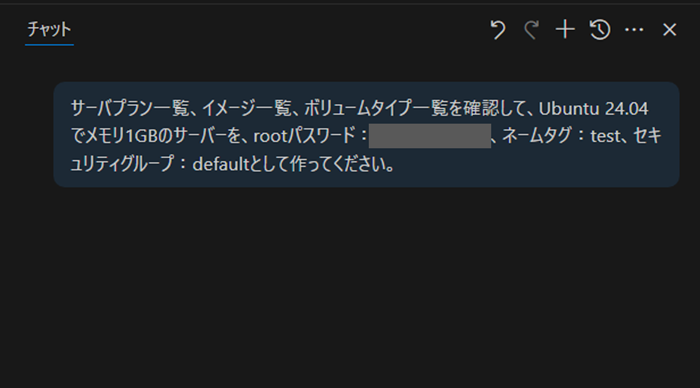
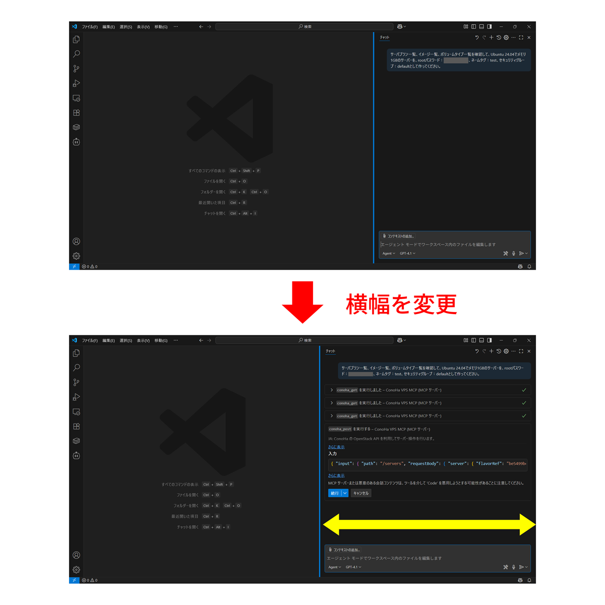

# よくある質問（FAQ）

## 基本的な質問

### Q: このMCPサーバーは何ができますか？

A: ConoHa VPSのOpenStack APIを日本語で操作できます。サーバーの作成・削除・停止・起動、ボリューム管理、イメージ管理、セキュリティグループの設定などが可能です。

### Q: Windows/Macでも動きますか？

A: Node.js/Dockerが動作する環境であれば利用可能です。Windows、Mac、Linuxすべてに対応しています。

### Q: 商用利用できますか？

A: Apache 2.0 ライセンスの範囲でご自由にご利用いただけます。

### Q: ベータ版とはどういう意味ですか？

A: 現在開発中のソフトウェアで、機能や動作が予告なく変更される可能性があります。本番環境での使用は推奨されません。

## 実行方法・設定関連

### Q: Node.jsのバージョンはどれが必要ですか？

A: Node.js v18以上が必要です。最新のLTS版を推奨します。[ダウンロード](https://nodejs.org/ja/download)

### Q: Docker版とNode.js版の違いは何ですか？

A: 機能は同じですが、Docker版は環境の統一が容易で、Node.js版は直接実行でき軽量です。お好みの環境に合わせてお選びください。

### Q: 認証情報はどこで取得できますか？

A: ConoHaコントロールパネルのAPI設定画面から取得できます。テナントID、ユーザーID、パスワードが必要です。

*https://manage.conoha.jp/V3/API/*

### Q: 環境変数の設定方法がわかりません

A: 各AIエージェントの設定ファイル（claude_desktop_config.json、.vscode/settings.json等）に記載します。詳細は各実行ガイドをご確認ください。

### Q: PATH_TO_DIRECTORYには何を入れればいいですか？

A: プロジェクトをクローンしたディレクトリの絶対パスを入力してください。例：`/Users/username/conoha_vps_mcp`

## 利用・操作関連

### Q: どのAIエージェントで利用できますか？

A: Claude Desktop、Cline（VSCode）、GitHub Copilot（VSCode）など、MCPプロトコルに対応したAIエージェントで利用できます。

### Q: GitHub Copilot や Cline において、使用するAIモデルによるツール実行結果や応答の違いはありますか？

A: 使用する AI モデルによってツール実行の精度や意図の汲み取り方に違いがあります。本MCPサーバーの操作においては、Claude Sonnet が GPT 系モデルと比べてツール呼び出しやパラメータ指定の解釈において精度が高く、より意図通りに動作する傾向があります。  
そのため、Cline や GitHub Copilot 上でツールを実行する際には、Claude Sonnet を使用することを推奨しています。

### Q: 日本語でコマンドを実行できますか？

A: はい。「現在あるサーバーの一覧を表示してください。」のような自然な日本語で操作できます。

### Q: サーバー作成時に料金は発生しますか？

A: はい。API実行の結果として実際にConoHa VPSのリソースが作成されるため、通常のConoHa VPS料金が発生します。

### Q: 操作を取り消すことはできますか？

A: 一度実行された操作（サーバー削除等）は取り消すことができません。実行の際は、内容を十分ご確認のうえ、慎重に行ってください。

### Q: 複数のサーバーを一括操作できますか？

A: はい。「すべてのサーバーを停止してください」のような一括操作も可能です。

### Q: パスワードなど、必要な情報は自分で設定したい

A: AIに「必要な情報はその都度確認してください」と指示することで、情報の設定が必要なタイミングで確認してくれるようになります。

## トラブルシューティング

### Q: AIエージェントが意図と異なる回答やツール実行を行います

A: GitHub Copilot や Cline でのツール実行の際、Visual Studio Code 上でファイルを開いている場合、開いているファイルの内容が自動的に AI エージェントの入力文脈として参照されることがあります。  
そのため、開いているファイルが現在のプロンプトと関係ない内容であった場合、AI の応答がそちらに引きずられて精度が低下したり、意図しない動作が発生することがありますので、ご注意ください。

### Q: Node.js をインストールしたのに、PowerShell 上で `npm` コマンドが動作しません

A: Node.js を正常にインストールしていても、PowerShell の実行ポリシー（ExecutionPolicy）の設定により、`npm` コマンドが正しく動作しない場合があります。  
`npm` 実行時にエラーが発生する場合は、PowerShell の実行ポリシーを確認してください。

### Q: 認証エラーが発生します

A: 以下を確認してください：

- テナントID、ユーザーID、パスワードが正しく設定されているか
- APIユーザーが有効になっているか
- 環境変数の記載にタイポがないか

### Q: MCPサーバーが起動しません

A: docs/配下の各実行ガイド末尾のトラブルシューティングをご覧ください。

- [簡単実行ガイド](./easy-setup.md)
- [Node.js ローカルビルド版実行ガイド](./nodejs-setup.md)
- [Docker ローカルビルド版実行ガイド](./docker-setup.md)

### Q: AIエージェントでツールが表示されません

A: 以下を確認してください：

- 設定ファイルが正しい場所に配置されているか
- JSON形式に構文エラーがないか
- AIエージェントを再起動したか

### Q: Docker版で起動エラーが発生します

A: 以下を確認してください：

- Dockerが正常に動作しているか
- WSLが有効になっているか（Windows環境の場合）
- `compose.yaml`が存在するか

### Q: GitHub Copilot (VSCode) 上でツールを実行しようとするとやりとりが止まってしまいます

A: 2025年7月15日現在、GitHub Copilot (VSCode) 上で比較的長めのやり取りをすると、下記の画像のように途中でやりとりが止まっているように見える事象が確認されています。  

これはGitHub Copilot (VSCode) 側のバグと思われる動作であり、現在調査・対応を進めております。  
現状の対策方法としては、途中でやりとりが止まってしまった際にチャット画面の横幅を適宜変えることで、やりとりを進めることができることを確認しております。

### Q: Claude Desktop 上でツールを実行しようとすると invalid argument エラーになります

A: 2025年7月15日現在、Claude Desktop 上で conoha_post および conoha_post_put_by_param のツールが利用できない事象が確認されています。  
これは Claude Desktop 側のバグと思われる動作であり、現在調査・対応を進めております。
修正が確認でき次第、ドキュメントを更新し、リリースノート にてご案内いたします。
ご不便をおかけし申し訳ございませんが、対応完了まで今しばらくお待ちください。

### Q: Windows環境でWSLエラーが発生します

A: WSL2が有効になっており、Ubuntuなどのディストリビューションがインストールされていることを確認してください。

## API・技術仕様関連

### Q: ConoHa VPSのどのバージョンに対応していますか？

A: ConoHa VPS v3.0 APIに対応しています。

### Q: OpenStackの知識は必要ですか？

A: 基本的な操作は日本語で可能ですので必要ありません。ただし、高度な設定にはOpenStackの知識があると便利です。

### Q: API利用制限はありますか？

A: ConoHa VPS APIの利用制限に準拠します。詳細は[ConoHa公式ドキュメント](https://doc.conoha.jp/reference/api-vps3/?btn_id=reference-api-compute-vps3--breadcrumbs_reference-api-vps3)をご確認ください。

### Q: セキュリティは大丈夫ですか？

A: 認証情報はローカル環境でのみ使用され、外部に送信されることはありません。ただし、適切な権限管理を行ってください。

## その他

### Q: バグを見つけた場合はどうすればいいですか？

A: [GitHub Issues](https://github.com/gmo-internet/conoha_vps_mcp/issues)でご報告ください。

### Q: 機能要望を出すことはできますか？

A: [GitHub Issues](https://github.com/gmo-internet/conoha_vps_mcp/issues)で機能要望を受け付けています。

### Q: コントリビュートしたいのですが？

A: [CONTRIBUTING.md](../CONTRIBUTING.md)をご確認ください。

### Q: 商用サポートはありますか？

A: 現在、商用サポートは提供しておりません。コミュニティベースでの開発となります。
