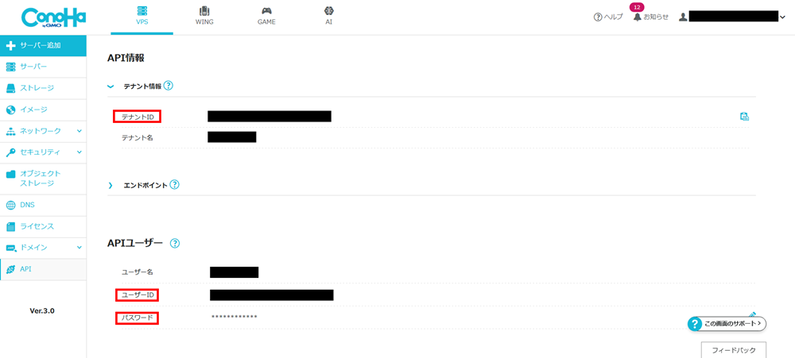

# よくある質問（FAQ）

## 基本的な質問

<details>
<summary>質問一覧</summary>

### Q: このMCPサーバーは何ができますか？

A: ConoHa VPSのOpenStack APIを日本語で操作できます。サーバーの作成・削除・停止・起動、ボリューム管理、イメージ管理、セキュリティグループの設定などが可能です。

### Q: Windows/Macでも動きますか？

A: Node.js/Dockerが動作する環境であれば利用可能です。Windows、Mac、Linuxすべてに対応しています。

### Q: 商用利用できますか？

A: はい。Apache 2.0 ライセンスの範囲で自由に利用できます。

</details>

## 実行方法・設定関連

<details>
<summary>質問一覧</summary>

### Q: Node.jsのバージョンはどれが必要ですか？

A: Node.js v20以上が必要です。最新のLTS版を推奨します。[ダウンロード](https://nodejs.org/ja/download)

### Q: Docker版とNode.js版の違いは何ですか？

A: 機能は同じです。Docker版は環境を統一しやすく、Node.js版は直接実行できて軽量です。好みに合わせて選んでください。

### Q: 認証情報はどこで取得できますか？

A: ConoHaコントロールパネルのAPI設定画面から取得できます。テナントID、ユーザーID、パスワードが必要です。


*https://manage.conoha.jp/V3/API/*

### Q: 環境変数の設定方法がわかりません

A: 各AIエージェントの設定ファイル（claude_desktop_config.json、.vscode/settings.json等）に記載します。詳しくは各実行ガイドを参照してください。

### Q: PATH_TO_DIRECTORYには何を入れればいいですか？

A: プロジェクトをクローンしたディレクトリの絶対パスを入力してください。例：`/Users/username/conoha_vps_mcp`

</details>

## 利用・操作関連

<details>
<summary>質問一覧</summary>

### Q: どのAIエージェントで利用できますか？

A: Cursor、Claude Desktop、GitHub Copilot（VSCode/CLI）、Codex CLI、Cline（VSCode）など、MCPプロトコルに対応したAIエージェントで利用できます。

### Q: GitHub Copilot や Cline において、使用するAIモデルによるツール実行結果や応答の違いはありますか？

A: AIモデルによってツール実行の精度や意図の汲み取り方に違いがあります。Claude Sonnet/Opus の方がGPT系モデルよりツール呼び出しの精度が高く、意図通りに動きやすいです（2026年1月現在）。
Cursor、GitHub Copilot（VSCode/CLI）、Codex CLI、Cline上で使う場合は、Claude Sonnet/Opusの利用を推奨します。

### Q: 日本語でコマンドを実行できますか？

A: はい。「現在あるサーバーの一覧を表示してください。」のような自然な日本語で操作できます。

### Q: サーバー作成時に料金は発生しますか？

A: はい。API実行の結果として実際にConoHa VPSのリソースが作成されるため、通常のConoHa VPS料金が発生します。

### Q: 操作を取り消すことはできますか？

A: 一度実行された操作（サーバー削除等）は取り消せません。実行前に内容をよく確認してください。

### Q: 複数のサーバーを一括操作できますか？

A: はい。「すべてのサーバーを停止してください」のような一括操作も可能です。

### Q: パスワードなど、必要な情報は自分で設定したい

A: AIに「必要な情報はその都度確認してください」と指示することで、情報の設定が必要なタイミングで確認してくれるようになります。

</details>

## トラブルシューティング

<details>
<summary>質問一覧</summary>

### Q: スタートアップスクリプトが正しく実行されません

A: スタートアップスクリプト付きのサーバー作成では、AIエージェントへの指示が曖昧だと正しく実行されないことがあります。
プロンプト例は [README.md](../README.md#スタートアップスクリプト利用したサーバー作成) の「スタートアップスクリプト利用したサーバー作成」を参照してください。

### Q: スタートアップスクリプトを利用してサーバーの作成を指示したところ、作成中の状態が長時間続いてしまい、完了までにかなり時間がかかってしまいます。

A: スタートアップスクリプトによっては作成完了までに5分から10分程度かかる場合があります。

### Q: AIエージェントによって発行されたオブジェクトストレージのWeb公開URLにアクセスすると、Unauthorizedエラーが発生してしまいます

A: まずはアクセスしたいオブジェクトに、Web公開の権限が付与されているか確認してください。権限が付与されているにも関わらずエラーが発生している場合、誤ったURLが出力されている可能性があります。正しいURL構造は以下の通りです。

```
https://object-storage.c3j1.conoha.io/v1/AUTH_{tenantId}/{container-name}/{object-name}
```

### Q: AIエージェントが意図と異なる回答やツール実行を行います

A: GitHub CopilotやClineでは、VSCode上で開いているファイルの内容がAIの入力コンテキストに含まれることがあります。
関係ないファイルを開いていると、AIの応答がそちらに引きずられて精度が下がることがあるため、不要なファイルは閉じておいてください。

### Q: Node.js をインストールしたのに、PowerShell 上で `npm` コマンドが動作しません

A: PowerShellの実行ポリシー（ExecutionPolicy）が原因で`npm`が動作しないことがあります。
`npm`実行時にエラーが出る場合は、実行ポリシーの設定を確認してください。

### Q: 認証エラーが発生します

A: 以下を確認してください：

- テナントID、ユーザーID、パスワードが正しく設定されているか
- APIユーザーが有効になっているか
- 環境変数の記載にタイポがないか

### Q: MCPサーバーが起動しません

A: docs/配下の各実行ガイド末尾のトラブルシューティングをご覧ください。

- [mcpb ファイルインストール版実行ガイド](./mcpb-setup.md)
- [npm パッケージインストール版実行ガイド](./npm-setup.md)
- [Node.js ローカルビルド版実行ガイド](./nodejs-setup.md)
- [Docker ローカルビルド版実行ガイド](./docker-setup.md)

### Q: AIエージェントでツールが表示されません

A: 以下を確認してください：

- 設定ファイルが正しい場所に配置されているか
- JSON形式に構文エラーがないか
- AIエージェントを再起動したか

### Q: Docker版で起動エラーが発生します

A: 以下を確認してください：

- Dockerが正常に動作しているか
- WSLが有効になっているか（Windows環境の場合）

### Q: GitHub Copilot (CLI)でMCPサーバーの設定をしたところ、そのサーバーが呼び出されません。

A: まずは入力したプロンプト文を見直してください。プロンプト文によってはうまく意図が伝わらない場合があります。
それでも解決しない場合は、Copilotの再起動、ターミナルの再起動などを行ってください。

### Q: Windows環境でWSLエラーが発生します

A: WSL2が有効になっており、Ubuntuなどのディストリビューションがインストールされていることを確認してください。

</details>

## API・技術仕様関連

<details>
<summary>質問一覧</summary>

### Q: ConoHa VPSのどのバージョンに対応していますか？

A: ConoHa VPS v3.0 APIに対応しています。

### Q: OpenStackの知識は必要ですか？

A: 基本的な操作は日本語で可能ですので必要ありません。ただし、高度な設定にはOpenStackの知識があると便利です。

### Q: API利用制限はありますか？

A: ConoHa VPS APIの利用制限に準拠します。詳しくは[ConoHa公式ドキュメント](https://doc.conoha.jp/reference/api-vps3/)を確認してください。

### Q: セキュリティは大丈夫ですか？

A: 認証情報はローカル環境でのみ使用され、外部に送信されることはありません。ただし、適切な権限管理を行ってください。

</details>

## その他

<details>
<summary>質問一覧</summary>

### Q: バグを見つけた場合はどうすればいいですか？

A: [GitHub Issues](https://github.com/gmo-internet/conoha_vps_mcp/issues)でご報告ください。

### Q: 機能要望を出すことはできますか？

A: [GitHub Issues](https://github.com/gmo-internet/conoha_vps_mcp/issues)で機能要望を受け付けています。

### Q: コントリビュートしたいのですが？

A: [CONTRIBUTING.md](../CONTRIBUTING.md)をご確認ください。

### Q: 商用サポートはありますか？

A: 現在、商用サポートは提供していません。コミュニティベースでの開発です。

</details>
