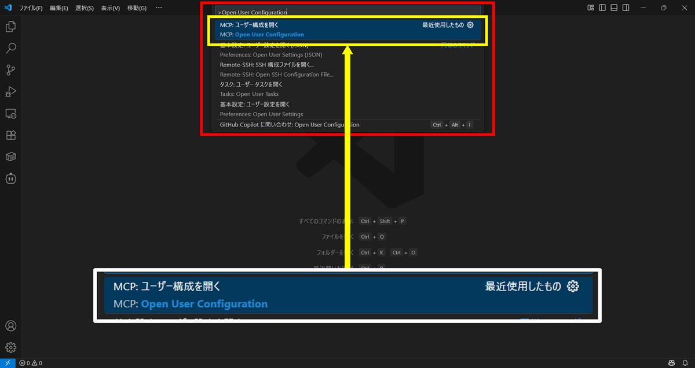
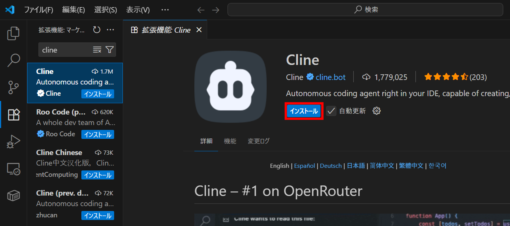
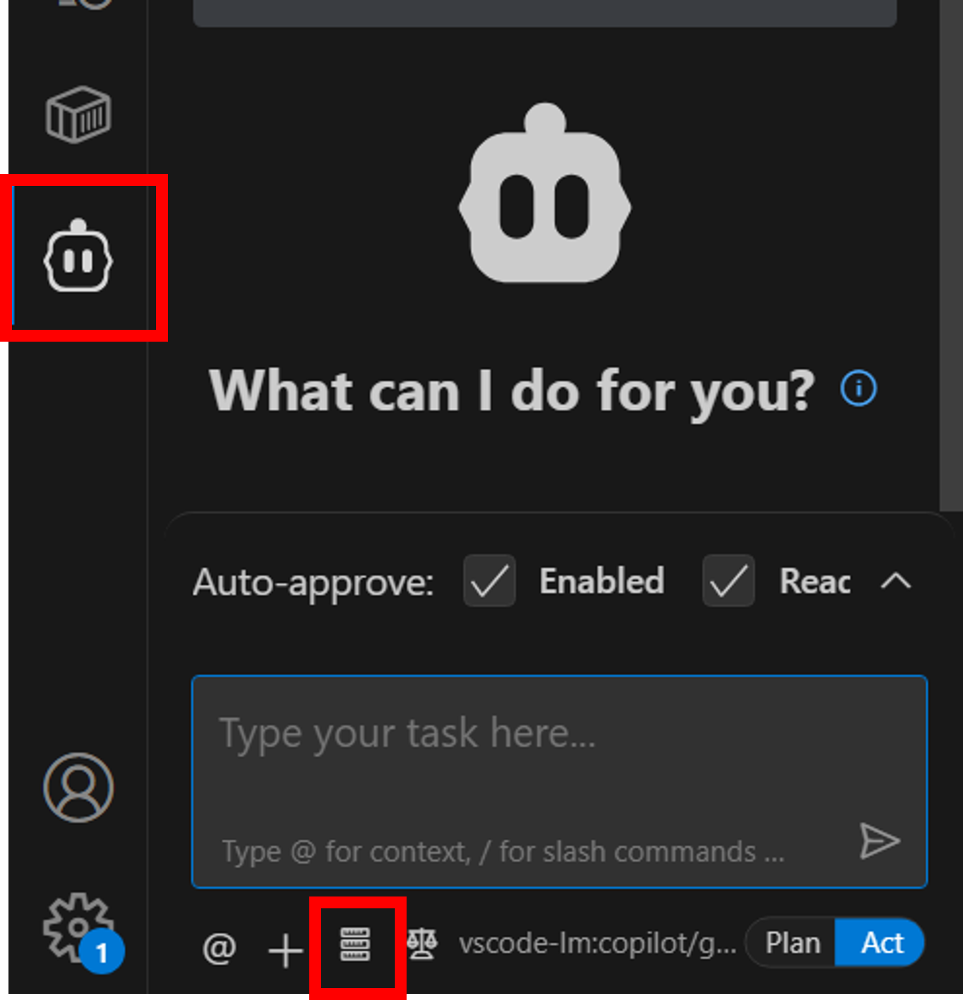

# Docker ローカルビルド版実行ガイド

## 目次

- [Docker ローカルビルド版実行ガイド](#docker-ローカルビルド版実行ガイド)
  - [目次](#目次)
  - [前提条件](#前提条件)
  - [プロジェクトの準備](#プロジェクトの準備)
  - [AIエージェント別設定方法](#aiエージェント別設定方法)
    - [GitHub Copilot (VSCode)](#github-copilot-vscode)
      - [1. 設定の追加](#1-設定の追加)
        - [Windows環境](#windows環境)
        - [Mac/Linux環境](#maclinux環境)
      - [2. 設定値の確認](#2-設定値の確認)
      - [3. MCPサーバーの起動](#3-mcpサーバーの起動)
      - [4. ツールの使用](#4-ツールの使用)
    - [Cline (VSCode)](#cline-vscode)
      - [1. VSCodeにおけるClineのインストール](#1-vscodeにおけるclineのインストール)
      - [2. Clineの設定の追加](#2-clineの設定の追加)
      - [3. 設定値の確認](#3-設定値の確認)
      - [4. ツールの使用](#4-ツールの使用-1)
    - [Claude Desktop](#claude-desktop)
      - [1. Claude Desktopの設定の追加](#1-claude-desktopの設定の追加)
      - [2. 設定値の確認](#2-設定値の確認-1)
      - [3. ツールの使用](#3-ツールの使用)
  - [トラブルシューティング](#トラブルシューティング)
    - [よくある問題](#よくある問題)

Docker を使用したConoHa VPS MCPのセットアップ手順を説明します。

## 前提条件

- **Docker**: Windows/Mac/Linux対応
- **WSL2**: Ubuntuなどのディストリビューションがインストール済み（Windows環境の場合）

## プロジェクトの準備

```bash
git clone https://github.com/gmo-internet/conoha_vps_mcp
cd conoha_vps_mcp
docker build -t conoha-vps-mcp .
```

## AIエージェント別設定方法

### GitHub Copilot (VSCode)

<details>
<summary>セットアップ手順</summary>

#### 1. 設定の追加

1. VSCode上の画面で`ctrl + Shift + P`を実行してコマンドパレットを開きます

2. 上部の検索窓で`Open User Configuration`と入力します（大文字小文字は区別しません）

   

3. 「MCP: ユーザー構成を開く」をクリックします
   
  

4. 開いたmcp.jsonに以下の設定を追加します：

##### Windows環境

```json
{
  "inputs": [
    {
      "type": "promptString",
      "id": "openstack-tenant-id",
      "description": "OpenStack Tenant ID"
    },
    {
      "type": "promptString",
      "id": "openstack-user-id",
      "description": "OpenStack User ID"
    },
    {
      "type": "promptString",
      "id": "openstack-password",
      "description": "OpenStack Password",
      "password": true
    }
  ],
  "servers": {
    "ConoHa VPS MCP": {
      "command": "wsl",
      "cwd": "PATH_TO_DIRECTORY",
      "args": [
        "docker",
        "run",
        "-i",
        "--rm",
        "-e",
        "OPENSTACK_TENANT_ID=${input:openstack-tenant-id}",
        "-e",
        "OPENSTACK_USER_ID=${input:openstack-user-id}",
        "-e",
        "OPENSTACK_PASSWORD=${input:openstack-password}",
        "conoha-vps-mcp"
      ]
    }
  }
}
```

##### Mac/Linux環境

```json
{
  "inputs": [
    {
      "type": "promptString",
      "id": "openstack-tenant-id",
      "description": "OpenStack Tenant ID"
    },
    {
      "type": "promptString",
      "id": "openstack-user-id",
      "description": "OpenStack User ID"
    },
    {
      "type": "promptString",
      "id": "openstack-password",
      "description": "OpenStack Password",
      "password": true
    }
  ],
  "servers": {
    "ConoHa VPS MCP": {
      "command": "docker",
      "cwd": "PATH_TO_DIRECTORY",
      "args": [
        "run",
        "-i",
        "--rm",
        "-e",
        "OPENSTACK_TENANT_ID=${input:openstack-tenant-id}",
        "-e",
        "OPENSTACK_USER_ID=${input:openstack-user-id}",
        "-e",
        "OPENSTACK_PASSWORD=${input:openstack-password}",
        "conoha-vps-mcp"
      ]
    }
  }
}
```

#### 2. 設定値の確認

- 環境変数の設定値：

```txt
OPENSTACK_TENANT_ID: テナントID
OPENSTACK_USER_ID: APIユーザーのユーザーID
OPENSTACK_PASSWORD: APIユーザーのパスワード
```

各値はConoHaコントロールパネルのAPI設定で確認できます。


*https://manage.conoha.jp/V3/API/*


> 💡
> 必要に応じて`.env`ファイルを用意し、`--env-file`オプションで指定することも可能です。

#### 3. MCPサーバーの起動

編集したjsonファイル上に表示される起動ボタンをクリックして、MCPサーバーを起動します。その際、環境変数の初期設定を求められるので、確認した設定値を入力してください。


> 📌
> 環境変数の入力欄は起動ボタンをクリックした後に、画面上部に表示されます。
> 
> 

#### 4. ツールの使用

1. GitHub Copilotを起動します
   - **Windows/Linux**: `Ctrl + Shift + I`
   - **Mac**: `Command + Shift + I`

2. チャット欄のドロップダウンメニューから**Agent**モードを選択します

3. チャット欄の**ツール**ボタンをクリックして、**MCPサーバー：ConoHa VPS MCP**を選択します

   

4. プロンプトを入力して操作を実行します

   [サンプルプロンプト](../README.md#-使用例)

</details>

### Cline (VSCode)

<details>
<summary>セットアップ手順</summary>

#### 1. VSCodeにおけるClineのインストール

1. VSCode左側の拡張機能メニューを開きます

   

2. 上部の検索窓で「cline」と検索し、Clineをインストールします

   

#### 2. Clineの設定の追加

1. VSCode左側のClineメニューを開き、適切なプランを選択するとMCPサーバーアイコンが表示されるため、これをクリックします

   

2. 歯車アイコンから設定を開き、 **[Configure MCP Servers]** をクリックします

   

3. `cline_mcp_settings.json`に以下の設定を追加します：

```json
{
  "mcpServers": {
    "ConoHa VPS MCP": {
      "command": "docker",
      "args": [
        "run",
        "-i",
        "--rm",
        "-e",
        "OPENSTACK_TENANT_ID=YOUR_OPENSTACK_TENANT_ID",
        "-e",
        "OPENSTACK_USER_ID=YOUR_OPENSTACK_USER_ID",
        "-e",
        "OPENSTACK_PASSWORD=YOUR_OPENSTACK_PASSWORD",
        "conoha-vps-mcp"
      ]
    }
  }
}
```

#### 3. 設定値の確認

- 環境変数の設定値：

```txt
OPENSTACK_TENANT_ID: テナントID
OPENSTACK_USER_ID: APIユーザーのユーザーID
OPENSTACK_PASSWORD: APIユーザーのパスワード
```

各値はConoHaコントロールパネルのAPI設定で確認できます。


#### 4. ツールの使用

1. チャット欄右下の切り替えメニューから**Act**モードを選択します

2. プロンプトを入力して操作を実行します

   [サンプルプロンプト](../README.md#-使用例)

</details>

### Claude Desktop

<details>
<summary>セットアップ手順</summary>

#### 1. Claude Desktopの設定の追加

1. メニューバーから **[ファイル]** → **[設定]** を開きます

   

2. 左側のメニューから **[開発者]** タブを選択します

   

3. **[構成を編集]** をクリックします

4. `claude_desktop_config.json`を開き、以下の設定を追加します：

```json
{
  "mcpServers": {
    "ConoHa VPS MCP": {
      "command": "docker",
      "args": [
        "run",
        "-i",
        "--rm",
        "-e",
        "OPENSTACK_TENANT_ID=YOUR_OPENSTACK_TENANT_ID",
        "-e",
        "OPENSTACK_USER_ID=YOUR_OPENSTACK_USER_ID",
        "-e",
        "OPENSTACK_PASSWORD=YOUR_OPENSTACK_PASSWORD",
        "conoha-vps-mcp"
      ]
    }
  }
}
```

#### 2. 設定値の確認

- 環境変数の設定値：

```txt
OPENSTACK_TENANT_ID: テナントID
OPENSTACK_USER_ID: APIユーザーのユーザーID
OPENSTACK_PASSWORD: APIユーザーのパスワード
```

各値はConoHaコントロールパネルのAPI設定で確認できます。


#### 3. ツールの使用

プロンプトを入力して操作を実行します

   [サンプルプロンプト](../README.md#-使用例)

</details>

## トラブルシューティング

### よくある問題

- **認証エラー**: 環境変数の値が正しく設定されているか確認してください
- **Docker起動エラー**: Dockerが正常に動作しているか確認してください
- **WSL2エラー**: Windows環境でWSLが正しく設定されているか確認してください
- その他FAQは[こちら](FAQ.md)

> [!TIP]
> 問題が解決しない場合は、[GitHub Issues](https://github.com/gmo-internet/conoha_vps_mcp/issues)でお気軽にお問い合わせください。