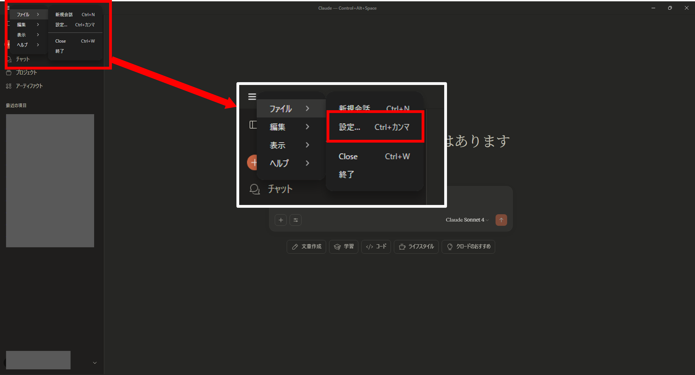
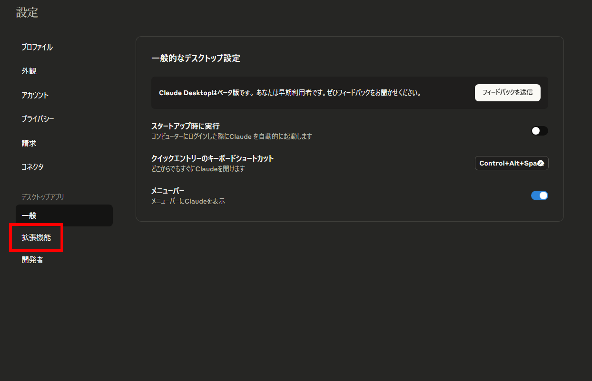
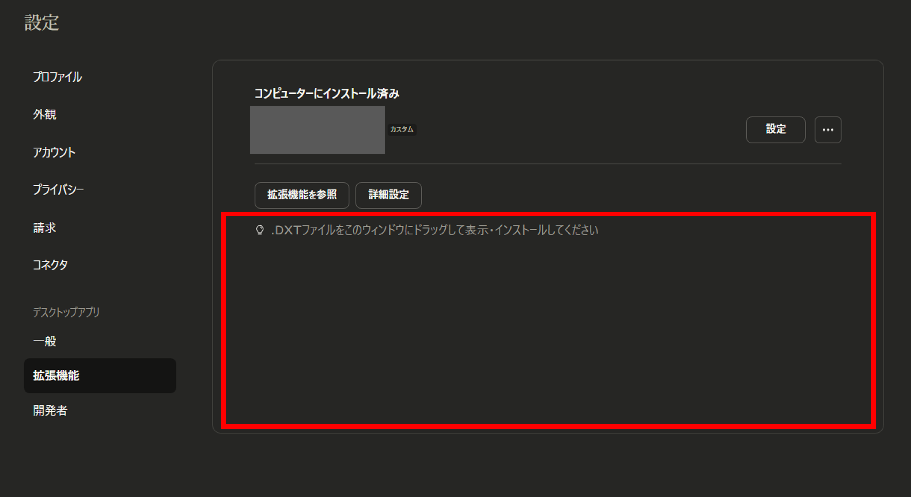
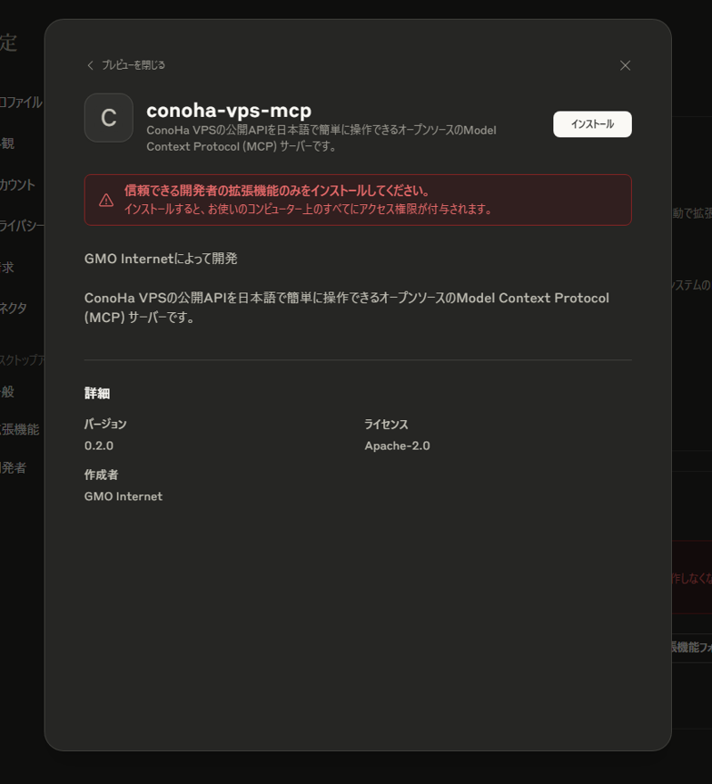
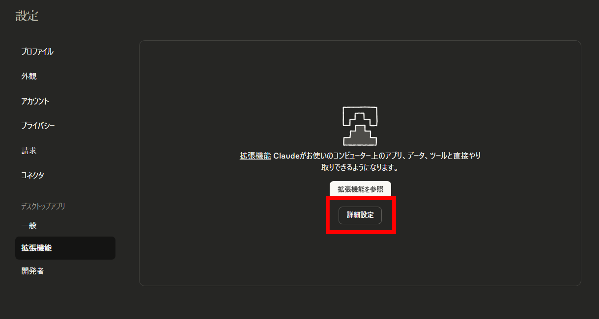
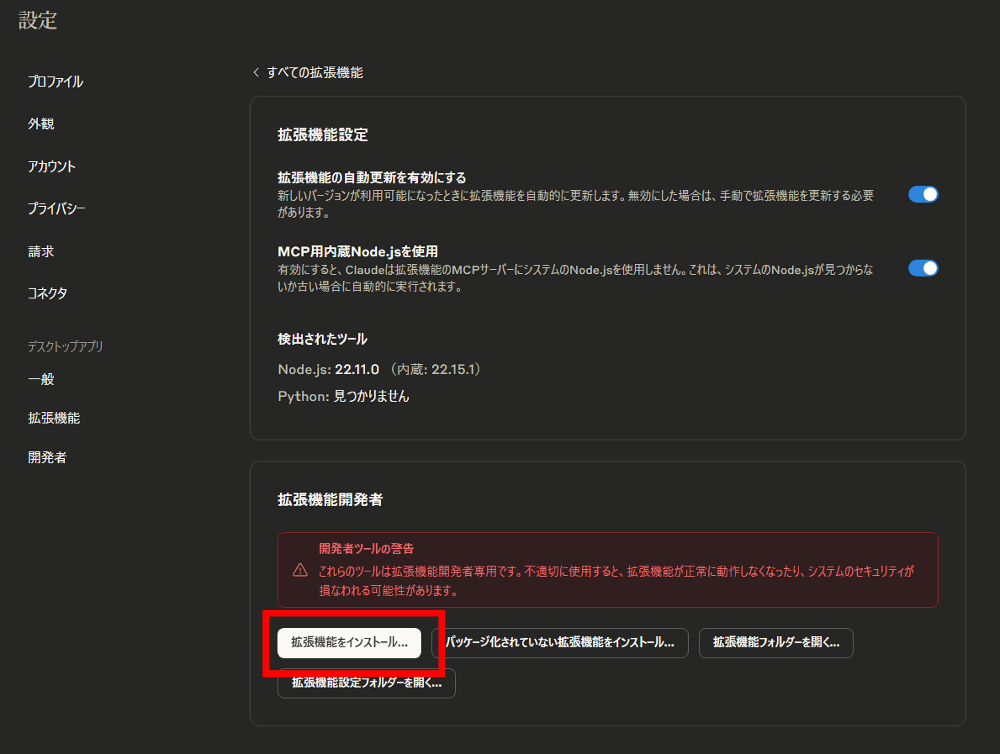
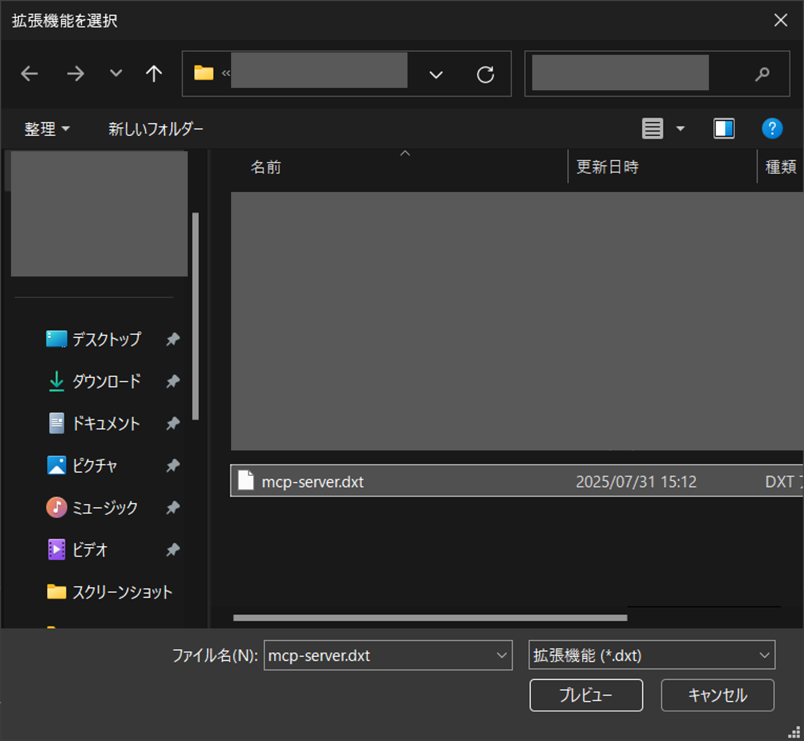
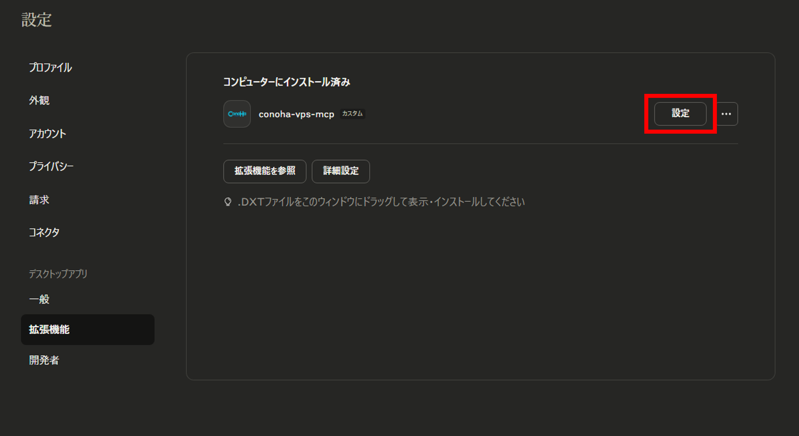
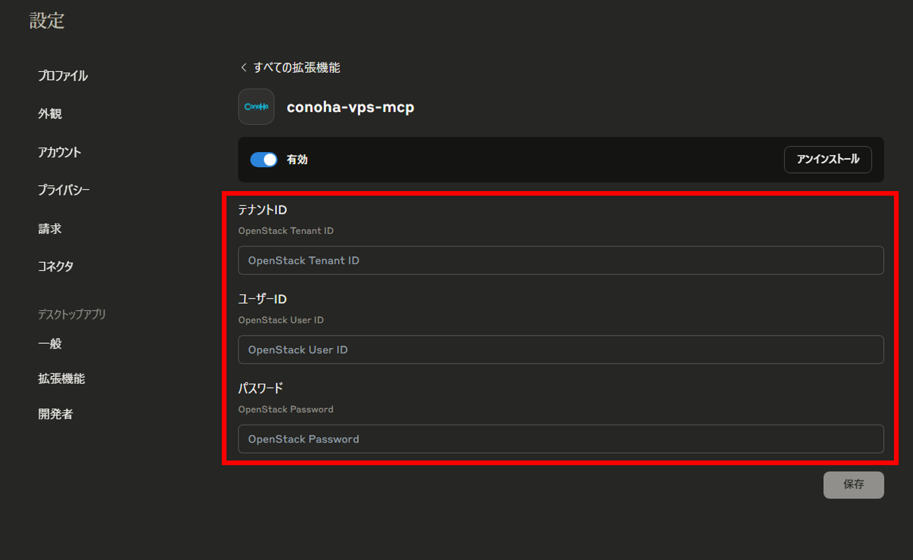

# 簡単実行ガイド

## 目次

- [簡単実行ガイド](#簡単実行ガイド)
  - [目次](#目次)
  - [前提条件](#前提条件)
  - [セットアップ手順](#セットアップ手順)
    - [DXTファイルのダウンロード](#dxtファイルのダウンロード)
    - [DXTファイルのインストール](#dxtファイルのインストール)
    - [環境変数の設定](#環境変数の設定)
    - [ツールの使用](#ツールの使用)

このドキュメントでは、ConoHa VPS MCP をローカル環境にコードのクローンやビルドをすることなく、**簡単に**MCPサーバーをインストールして実行する方法を説明します。

## 前提条件

- **Claude Desktop**最新バージョンがインストール済み
  
## セットアップ手順

### DXTファイルのダウンロード

1. Releasesより、最新リリースノートを開きます  
    [最新リリースノート](https://github.com/gmo-internet/conoha_vps_mcp/releases/latest)
2. Assetsより`conoha_vps_mcp.dxt`ファイルをダウンロードしてください（ファイル名をクリックするとダウンロードが開始されます）

### DXTファイルのインストール

1. 左上のメニューより、`ファイル → 設定`で設定画面を開きます

    
2. 設定画面より**拡張機能**をクリックします

    

既に他の拡張機能がインストールされている場合

1. `.DXTファイルをこのウィンドウにドラッグして表示・インストールしてください`と書かれている部分に、先ほどダウンロードしたDXTファイルをドラッグしてください

    

2. 内容を確認して最後に右上の**インストール**をクリックして、DXTファイルをClaude Desktopにインストールします

    

他の拡張機能がインストールされていない場合

3. **詳細設定**をクリックします

    

4. **拡張機能をインストール...** をクリックします

    

5. 先ほどダウンロードしたDXTファイルを選択して**プレビュー**をクリックします

    

6. 内容を確認して最後に右上の**インストール**をクリックして、DXTファイルをClaude Desktopにインストールします

    

### 環境変数の設定

1. 設定画面の拡張機能タブに戻って、**conoha-vps-mcp**と書かれた拡張機能の欄にある**設定**をクリックします

    

1. ConoHa APIのテナントID、ユーザーID、パスワードを入力します。

    

    各値はConoHaコントロールパネルのAPI設定で確認できます。

    

    環境変数の入力が完了したら、最後に**保存**ボタンをクリックしてください。

### ツールの使用

プロンプトを入力して操作を実行します

   [サンプルプロンプト](../README.md#-使用例)