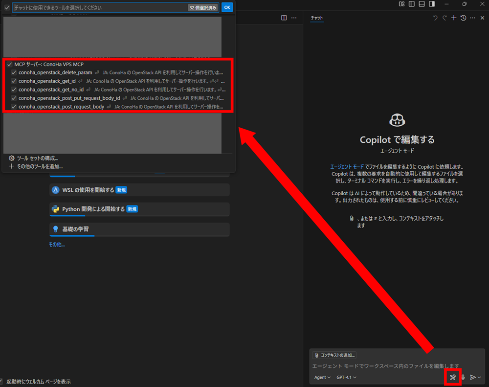

# 簡単実行ガイド

## 目次

- [簡単実行ガイド](#簡単実行ガイド)
  - [目次](#目次)
  - [前提条件](#前提条件)
    - [.npmrcファイルへのPATの登録手順](#npmrcファイルへのpatの登録手順)
  - [AIエージェント別実行方法](#aiエージェント別実行方法)
    - [GitHub Copilot (VSCode)](#github-copilot-vscode)
      - [1. 設定の追加](#1-設定の追加)
      - [2. 設定値の確認](#2-設定値の確認)
      - [3. MCPサーバーの起動](#3-mcpサーバーの起動)
      - [4. ツールの使用](#4-ツールの使用)
    - [Cline (VSCode)](#cline-vscode)
      - [1. VSCodeにおけるClineのインストール](#1-vscodeにおけるclineのインストール)
      - [2. Clineの設定の追加](#2-clineの設定の追加)
      - [3. 設定値の確認](#3-設定値の確認)
      - [4. ツールの使用](#4-ツールの使用-1)
    - [Claude Desktop](#claude-desktop)
      - [1. Claude Desktopの設定の追加](#1-claude-desktopの設定の追加)
      - [2. 設定値の確認](#2-設定値の確認-1)
      - [3. ツールの使用](#3-ツールの使用)
  - [トラブルシューティング](#トラブルシューティング)
    - [よくある問題](#よくある問題)

このドキュメントでは、ローカル環境にコードのクローンやビルドをすることなくConoHa VPS MCPを実行する方法を説明します。

## 前提条件

1. **Node.js v18以上**・**npm v7 以上**（Node.jsに付属）のインストール
2. **GitHubのPersonal Access Token**（以下PAT）の発行
3. **.npmrcファイル**へPATの登録

<details>
<summary>Node.jsのインストール手順（Windows向け）</summary>

1. Node.jsのダウンロードページにアクセスします [ダウンロードページ](https://nodejs.org/ja/download)
2. アーキテクチャーとOSを確認したうえで、ダウンロードページ下部にある「Windows インストーラー（.msi）」をクリックします
   
    

3. ダウンロードされたインストーラー（.msi）をダブルクリックします
4. しばらく待つとSetup Wizardが表示されるので、Nextを押します

    

5. ライセンス規約を一読したうえで同意（チェックを入力）をして、Nextを押します

    

6. 表示されているインストール先に問題がなければNextを押します（基本的にはデフォルトのままで問題ありません）

    

7. 追加でインストールするものがない場合は基本的に何も選択せず、Nextを押します（ConoHa VPS MCP Serverでは追加でインストールが必要なものはありません）

    

8. こちらも追加でインストールするものがない場合はチェックを入れず、Nextを押します（ConoHa VPS MCP Serverでは追加でインストールが必要なものはありません）

    

9.  Installボタンをクリックします

    

10.  インストールが完了したらFinishを押します

</details>

<details>
<summary>GitHubのPersonal Access Tokenの発行手順</summary>

1. [GitHubのダッシュボード画面](https://github.com/dashboard)の右上にあるアイコン画像をクリックします

1. アイコン画像をクリックして表示されたメニュー中にある`Settings`をクリックします


1. settings画面の左側のサイドメニューの最下部にある`Developer settings`をクリックします
   

   
2. Developer settings画面の左側サイドメニュー中にある`Personal access tokens`をクリックして展開されたメニューから、`Tokens (Classic)`をクリックします

1. `Generate new token (classic)`をクリックして、トークン生成画面にアクセスします

1. 必要事項を入力して、最後にページ下部にある`Generate token`ボタンをクリックしてトークンの生成を完了させます
   1. `read:packages`の権限を付与してください  
   
   
2. 以下のようにトークン値が生成されていれば完了です

> [!CAUTION]
> トークン値は一度しか表示されないので、必ず安全なところにメモしておくようにしてください。

</details>

### .npmrcファイルへのPATの登録手順

任意のディレクトリで以下のコマンドを実行して、.npmrcファイルを生成してください  
`ghp_xxxYourTokenxxx`にはGitHub上で発行したPATの値を入力してください

```bash
npm config set //npm.pkg.github.com/:_authToken=ghp_xxxYourTokenxxx
```

## AIエージェント別実行方法

### GitHub Copilot (VSCode)

> [!CAUTION]
> [VSCodeのJune 2025のアップデート (version 1.102)](https://code.visualstudio.com/updates/v1_102)により、設定方法が大きく変わっております。古いバージョンをご利用中の方は最新バージョンへの更新、あるいは公式のドキュメントをご参照ください。

<details>
<summary>セットアップ手順</summary>

#### 1. 設定の追加

1. VSCode上の画面で`ctrl + Shift + P`を実行してコマンドパレットを開きます

2. 上部の検索窓で`Open User Configuration`と入力します（大文字小文字は区別しません）

   

3. 「MCP: ユーザー構成を開く」をクリックします

  

4. 開いたmcp.jsonに以下の設定を追加します：

```json
{
    "inputs": [
      {
        "type": "promptString",
        "id": "openstack-tenant-id",
        "description": "OpenStack Tenant ID"
      },
      {
        "type": "promptString",
        "id": "openstack-user-id",
        "description": "OpenStack User ID"
      },
      {
        "type": "promptString",
        "id": "openstack-password",
        "description": "OpenStack Password",
        "password": true
      }
    ],
    "servers": {
      "ConoHa VPS MCP": {
        "command": "npm",
        "args": [
          "exec",
          "--@gmo-internet:registry=https://npm.pkg.github.com",
          "@gmo-internet/conoha-vps-mcp@latest"
        ],
        "env": {
          "OPENSTACK_TENANT_ID": "${input:openstack-tenant-id}",
          "OPENSTACK_USER_ID": "${input:openstack-user-id}",
          "OPENSTACK_PASSWORD": "${input:openstack-password}"
        }
      }
    }
}
```

#### 2. 設定値の確認

- 環境変数の設定値：

```txt
OPENSTACK_TENANT_ID: テナントID
OPENSTACK_USER_ID: APIユーザーのユーザーID
OPENSTACK_PASSWORD: APIユーザーのパスワード
```

各値はConoHaコントロールパネルのAPI設定で確認できます。


*https://manage.conoha.jp/V3/API/*

#### 3. MCPサーバーの起動

編集したjsonファイル上に表示される起動ボタンをクリックして、MCPサーバーを起動します。その際、環境変数の初期設定を求められるので、確認した設定値を入力してください。


> 📌
> 環境変数の入力欄は起動ボタンをクリックした後に、画面上部に表示されます。
> 
> 

#### 4. ツールの使用

1. GitHub Copilotを起動します
   - **Windows/Linux**: `Ctrl + Shift + I`
   - **Mac**: `Command + Shift + I`

2. チャット欄のドロップダウンメニューから**Agent**モードを選択します

3. チャット欄の**ツール**ボタンをクリックして、**MCPサーバー：ConoHa VPS MCP**を選択します

  

4. プロンプトを入力して操作を実行します

   [サンプルプロンプト](../README.md#-使用例)

</details>

### Cline (VSCode)

<details>
<summary>セットアップ手順</summary>

#### 1. VSCodeにおけるClineのインストール

1. VSCode左側の拡張機能メニューを開きます

   

2. 上部の検索窓で「cline」と検索し、Clineをインストールします

   

#### 2. Clineの設定の追加

1. VSCode左側のClineメニューを開き、適切なプランを選択するとMCPサーバーアイコンが表示されるため、これをクリックします

   

2. 歯車アイコンから設定を開き、 **[Configure MCP Servers]** をクリックします

   

3. `cline_mcp_settings.json`に以下の設定を追加します：

```json
{
  "mcpServers": {
    "ConoHa VPS MCP": {
      "command": "npm",
      "args": [
        "exec",
        "--@gmo-internet:registry=https://npm.pkg.github.com",
        "@gmo-internet/conoha-vps-mcp@latest"
      ],
      "env": {
        "OPENSTACK_TENANT_ID": "YOUR_OPENSTACK_TENANT_ID", // ここにテナントIDを入力
        "OPENSTACK_USER_ID": "YOUR_OPENSTACK_USER_ID", // ここにユーザーIDを入力
        "OPENSTACK_PASSWORD": "YOUR_OPENSTACK_PASSWORD" // ここにパスワードを入力
      }
    }
  }
}
```

#### 3. 設定値の確認

- 環境変数の設定値：

```txt
OPENSTACK_TENANT_ID: テナントID
OPENSTACK_USER_ID: APIユーザーのユーザーID
OPENSTACK_PASSWORD: APIユーザーのパスワード
```

各値はConoHaコントロールパネルのAPI設定で確認できます。


#### 4. ツールの使用

1. チャット欄右下の切り替えメニューから**Act**モードを選択します

2. プロンプトを入力して操作を実行します

   [サンプルプロンプト](../README.md#-使用例)

</details>

### Claude Desktop

> [!CAUTION]
> 2025年7月15日現在、Claude Desktopのバグと思われる事象により、`conoha_post`・`conoha_post_put_by_param`のtoolsが利用できなくなっております。
> 修正が確認でき次第ドキュメントを更新の上、[リリースノート](https://github.com/gmo-internet/conoha_vps_mcp/releases)に記載いたします。
> ご迷惑おかけし申し訳ございません。

<details>
<summary>セットアップ手順</summary>

#### 1. Claude Desktopの設定の追加

1. メニューバーから **[ファイル]** → **[設定]** を開きます

   

2. 左側のメニューから **[開発者]** タブを選択します

   

3. **[構成を編集]** をクリックします

4. `claude_desktop_config.json`を開き、以下の設定を追加します：

```json
{
  "mcpServers": {
    "ConoHa VPS MCP": {
      "command": "npm",
      "args": [
        "exec",
        "--@gmo-internet:registry=https://npm.pkg.github.com",
        "@gmo-internet/conoha-vps-mcp@latest"
      ],
      "env": {
        "OPENSTACK_TENANT_ID": "YOUR_OPENSTACK_TENANT_ID", // ここにテナントIDを入力
        "OPENSTACK_USER_ID": "YOUR_OPENSTACK_USER_ID", // ここにユーザーIDを入力
        "OPENSTACK_PASSWORD": "YOUR_OPENSTACK_PASSWORD" // ここにパスワードを入力
      }
    }
  }
}
```

#### 2. 設定値の確認

- 環境変数の設定値：

```txt
OPENSTACK_TENANT_ID: テナントID
OPENSTACK_USER_ID: APIユーザーのユーザーID
OPENSTACK_PASSWORD: APIユーザーのパスワード
```

各値はConoHaコントロールパネルのAPI設定で確認できます。


#### 3. ツールの使用

プロンプトを入力して操作を実行します

   [サンプルプロンプト](../README.md#-使用例)

</details>

## トラブルシューティング

### よくある問題

- **認証エラー**: 環境変数の値が正しく設定されているか確認してください
- **Node.jsバージョンエラー**: Node.js v18以上がインストールされているか確認してください
- **起動エラー**: `"--@gmo-internet:registry=..."` の記述ミスや、`@gmo-internet/conoha-vps-mcp@latest` のパッケージ名が正しいかを確認してください
- **パッケージ取得エラー**: `npm exec`の初回実行時にパッケージのダウンロードに時間がかかる場合があります
- その他FAQは[こちら](FAQ.md)

> [!TIP]
> 問題が解決しない場合は、[GitHub Issues](https://github.com/gmo-internet/conoha_vps_mcp/issues)でお気軽にお問い合わせください。
