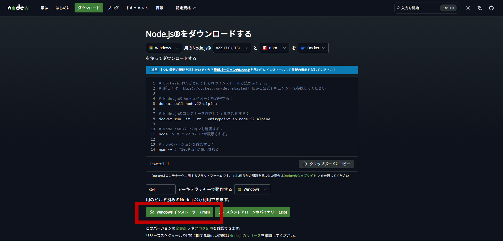
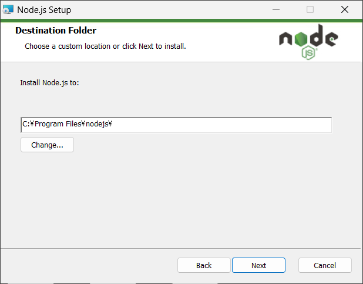

# 簡単実行ガイド

## 目次

- [簡単実行ガイド](#簡単実行ガイド)
  - [目次](#目次)
  - [前提条件](#前提条件)
  - [AIエージェント別実行方法](#aiエージェント別実行方法)
    - [Claude Desktop](#claude-desktop)
      - [1. Claude Desktopの設定の追加](#1-claude-desktopの設定の追加)
      - [2. 設定値の確認](#2-設定値の確認)
      - [3. ツールの使用](#3-ツールの使用)
    - [Cline (VSCode)](#cline-vscode)
      - [1. VSCodeにおけるClineのインストール](#1-vscodeにおけるclineのインストール)
      - [2. Clineの設定の追加](#2-clineの設定の追加)
      - [3. 設定値の確認](#3-設定値の確認)
      - [4. ツールの使用](#4-ツールの使用)
    - [GitHub Copilot (VSCode)](#github-copilot-vscode)
      - [1. VSCode設定の追加](#1-vscode設定の追加)
      - [2. 設定値の確認](#2-設定値の確認-1)
    - [3. MCPサーバーの起動](#3-mcpサーバーの起動)
    - [4. ツールの使用](#4-ツールの使用-1)
  - [トラブルシューティング](#トラブルシューティング)
    - [よくある問題](#よくある問題)

このドキュメントでは、ConoHa VPS MCP をローカル環境にインストールすることなく、`npm exec` コマンドを使って **即座に実行する方法** を説明します。

この方式では、パッケージをグローバルにもローカルにもインストールする必要がなく、以下の特徴があります：

- ✅ 必要なのは Node.js のみ
- ✅ VSCodeの`settings.json` に記述するだけで、対応AIエージェントからすぐに実行可能
- ✅ 最新のConoHa VPS MCPを毎回クリーンに呼び出せる
- ✅ セットアップや依存関係の管理が不要

## 前提条件

- **Node.js**: v18以上
- **npm**: Node.jsに付属

<details>
<summary>Node.jsのインストール手順（Windows向け）</summary>

1. Node.jsのダウンロードページにアクセスします [ダウンロードページ](https://nodejs.org/ja/download)
2. アーキテクチャーとOSを確認したうえで、ダウンロードページ下部にある「Windows インストーラー（.msi）」をクリックします
   
    

3. ダウンロードされたインストーラー（.msi）をダブルクリックします
4. しばらく待つとSetup Wizardが表示されるので、Nextを押します

    

5. ライセンス規約を一読したうえで同意（チェックを入力）をして、Nextを押します

    

6. 表示されているインストール先に問題がなければNextを押します（基本的にはデフォルトのままで問題ありません）

    

7. 追加でインストールするものがない場合は基本的に何も選択せず、Nextを押します（ConoHa VPS MCP Serverでは追加でインストールが必要なものはありません）

    

8. こちらも追加でインストールするものがない場合はチェックを入れず、Nextを押します（ConoHa VPS MCP Serverでは追加でインストールが必要なものはありません）

    

9.  Installボタンをクリックします

    

10.  インストールが完了したらFinishを押します

</details>

## AIエージェント別実行方法

### Claude Desktop

<details>
<summary>セットアップ手順</summary>

#### 1. Claude Desktopの設定の追加

1. メニューバーから **[ファイル]** → **[設定]** を開きます

   

2. 左側のメニューから **[開発者]** タブを選択します

   

3. **[構成を編集]** をクリックします

4. `claude_desktop_config.json`を開き、以下の設定を追加します：

```json
{
  "mcpServers": {
    "ConoHa VPS MCP": {
      "command": "npm",
      "args": [
        "exec",
        "--@gmo-internet:registry=https://npm.pkg.github.com",
        "@gmo-internet/conoha-vps-mcp"
      ],
      "env": {
        "OPENSTACK_TENANT_ID": "YOUR_OPENSTACK_TENANT_ID",
        "OPENSTACK_USER_ID": "YOUR_OPENSTACK_USER_ID",
        "OPENSTACK_PASSWORD": "YOUR_OPENSTACK_PASSWORD",
        "OPENSTACK_IDENTITY_BASE_URL": "https://identity.c3j1.conoha.io/v3",
        "OPENSTACK_COMPUTE_BASE_URL": "https://compute.c3j1.conoha.io/v2.1",
        "OPENSTACK_VOLUME_BASE_URL": "https://block-storage.c3j1.conoha.io/v3",
        "OPENSTACK_IMAGE_BASE_URL": "https://image-service.c3j1.conoha.io",
        "OPENSTACK_NETWORK_BASE_URL": "https://networking.c3j1.conoha.io"
      }
    }
  }
}
```

#### 2. 設定値の確認

- 環境変数の設定値：

```txt
OPENSTACK_TENANT_ID: テナントID
OPENSTACK_USER_ID: APIユーザーのユーザーID
OPENSTACK_PASSWORD: APIユーザーのパスワード
```

各値はConoHaコントロールパネルのAPI設定で確認できます。


#### 3. ツールの使用

プロンプトを入力して操作を実行します

   [サンプルプロンプト](../README.md#使用例)

</details>

### Cline (VSCode)

<details>
<summary>セットアップ手順</summary>

#### 1. VSCodeにおけるClineのインストール

1. VSCode左側の拡張機能メニューを開きます

   

2. 上部の検索窓で「cline」と検索し、Clineをインストールします

   

#### 2. Clineの設定の追加

1. VSCode左側のClineメニューを開き、適切なプランを選択するとMCPサーバーアイコンが表示されるため、これをクリックします

   

2. 歯車アイコンから設定を開き、 **[Configure MCP Servers]** をクリックします

   

3. `cline_mcp_settings.json`に以下の設定を追加します：

```json
{
  "mcpServers": {
    "ConoHa VPS MCP": {
      "command": "npm",
      "args": [
        "exec",
        "--@gmo-internet:registry=https://npm.pkg.github.com",
        "@gmo-internet/conoha-vps-mcp"
      ],
      "env": {
        "OPENSTACK_TENANT_ID": "YOUR_OPENSTACK_TENANT_ID",
        "OPENSTACK_USER_ID": "YOUR_OPENSTACK_USER_ID",
        "OPENSTACK_PASSWORD": "YOUR_OPENSTACK_PASSWORD",
        "OPENSTACK_IDENTITY_BASE_URL": "https://identity.c3j1.conoha.io/v3",
        "OPENSTACK_COMPUTE_BASE_URL": "https://compute.c3j1.conoha.io/v2.1",
        "OPENSTACK_VOLUME_BASE_URL": "https://block-storage.c3j1.conoha.io/v3",
        "OPENSTACK_IMAGE_BASE_URL": "https://image-service.c3j1.conoha.io",
        "OPENSTACK_NETWORK_BASE_URL": "https://networking.c3j1.conoha.io"
      }
    }
  }
}
```

#### 3. 設定値の確認

- 環境変数の設定値：

```txt
OPENSTACK_TENANT_ID: テナントID
OPENSTACK_USER_ID: APIユーザーのユーザーID
OPENSTACK_PASSWORD: APIユーザーのパスワード
```

各値はConoHaコントロールパネルのAPI設定で確認できます。


#### 4. ツールの使用

1. チャット欄右下の切り替えメニューから**Act**モードを選択します

2. プロンプトを入力して操作を実行します

   [サンプルプロンプト](../README.md#使用例)

</details>

### GitHub Copilot (VSCode)

<details>
<summary>セットアップ手順</summary>

#### 1. VSCode設定の追加

1. VSCode左下の歯車マークをクリックして設定を開きます

   

2. 上部の検索窓で「mcp」と検索します

   

3. 「settings.jsonで編集」をクリックします

4. `mcp`セクションに以下の設定を追加します：

```json
{
  "mcp": {
    "inputs": [
      {
        "type": "promptString",
        "id": "openstack-tenant-id",
        "description": "OpenStack Tenant ID"
      },
      {
        "type": "promptString",
        "id": "openstack-user-id",
        "description": "OpenStack User ID"
      },
      {
        "type": "promptString",
        "id": "openstack-password",
        "description": "OpenStack Password",
        "password": true
      }
    ],
    "servers": {
      "ConoHa VPS MCP": {
        "command": "npm",
        "args": [
          "exec",
          "--@gmo-internet:registry=https://npm.pkg.github.com",
          "@gmo-internet/conoha-vps-mcp"
        ],
        "env": {
          "OPENSTACK_TENANT_ID": "${input:openstack-tenant-id}",
          "OPENSTACK_USER_ID": "${input:openstack-user-id}",
          "OPENSTACK_PASSWORD": "${input:openstack-password}"
        }
      }
    }
  }
}
```

#### 2. 設定値の確認

- 環境変数の設定値：

```txt
OPENSTACK_TENANT_ID: テナントID
OPENSTACK_USER_ID: APIユーザーのユーザーID
OPENSTACK_PASSWORD: APIユーザーのパスワード
```

各値はConoHaコントロールパネルのAPI設定で確認できます。


*https://manage.conoha.jp/V3/API/*

### 3. MCPサーバーの起動

編集したjsonファイル上に表示される起動ボタンをクリックして、MCPサーバーを起動します。その際、環境変数の初期設定を求められるので、確認した設定値を入力してください。


*テナントID入力画面*

### 4. ツールの使用

1. GitHub Copilotを起動します
   - **Windows/Linux**: `Ctrl + Shift + I`
   - **Mac**: `Command + Shift + I`

2. チャット欄のドロップダウンメニューから**Agent**モードを選択します

3. チャット欄の**ツール**ボタンをクリックして、**MCPサーバー：ConoHa VPS MCP**を選択します

  

4. プロンプトを入力して操作を実行します

   [サンプルプロンプト](../README.md#-使用例)

</details>

## トラブルシューティング

### よくある問題

- **認証エラー**: 環境変数の値が正しく設定されているか確認してください
- **Node.jsバージョンエラー**: Node.js v18以上がインストールされているか確認してください
- **起動エラー**: `"--registry=..."` の記述ミスや、`@gmo-internet/conoha-vps-mcp` のパッケージ名が正しいかを確認してください
- **パッケージ取得エラー**: `npm exec`の初回実行時にパッケージのダウンロードに時間がかかる場合があります

> [!TIP]
> 問題が解決しない場合は、[GitHub Issues](https://github.com/gmo-internet/conoha_vps_mcp/issues)でお気軽にお問い合わせください。
