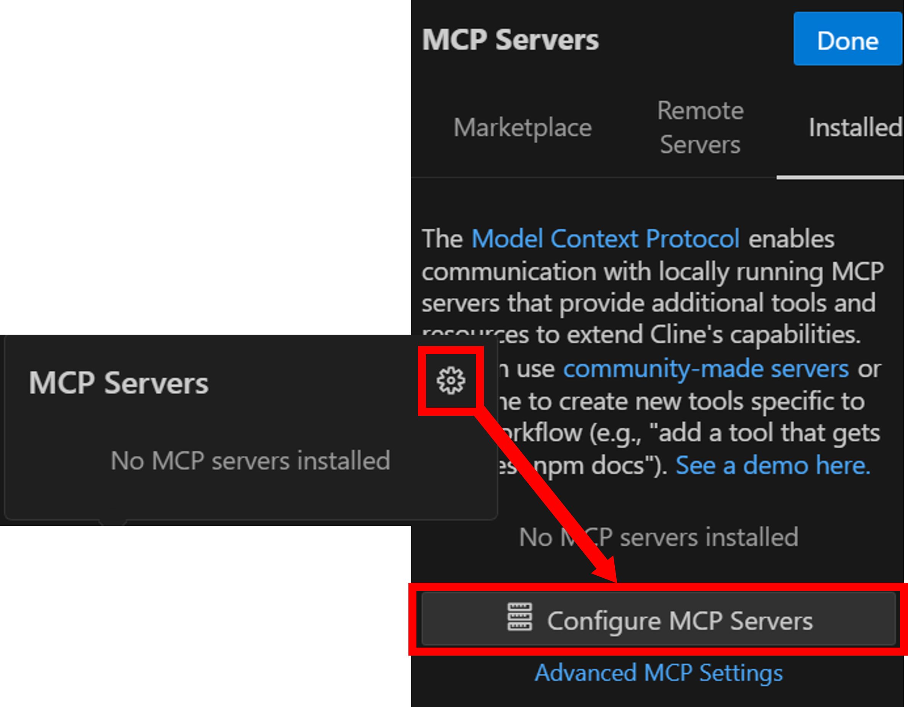

# 簡単実行ガイド

このドキュメントでは、ConoHa VPS MCP をローカル環境にインストールすることなく、`npm exec` コマンドを使って **即座に実行する方法** を説明します。

この方式では、パッケージをグローバルにもローカルにもインストールする必要がなく、以下の特徴があります：

- ✅ 必要なのは Node.js のみ
- ✅ VSCodeの`settings.json` に記述するだけで、対応AIアシスタントからすぐに実行可能
- ✅ 最新のConoHa VPS MCPを毎回クリーンに呼び出せる
- ✅ セットアップや依存関係の管理が不要

## 前提条件

- **Node.js**: v18以上
- **npm**: Node.jsに付属

## AIエージェント別実行方法

### Cline (VSCode)

#### 1. VSCodeにおけるClineのインストール

1. VSCode左側の拡張機能メニューを開きます

   

2. 上部の検索窓で「cline」と検索し、Clineをインストールします

   

#### 2. Clineの設定の追加

1. VSCode左側のClineメニューを開き、適切なプランを選択するとMCPサーバーアイコンが表示されるため、これをクリックします

   

2. 歯車アイコンから設定を開き、 **[Configure MCP Servers]** をクリックします

   

3. `cline_mcp_settings.json`に以下の設定を追加します：

```json
{
  "mcpServers": {
    "ConoHa VPS MCP": {
      "command": "npm",
      "args": [
        "exec",
        "--registry=https://npm.pkg.github.com",
        "@gmo-internet/conoha-vps-mcp"
      ],
      "env": {
        "OPENSTACK_TENANT_ID": "YOUR_OPENSTACK_TENANT_ID",
        "OPENSTACK_USER_ID": "YOUR_OPENSTACK_USER_ID",
        "OPENSTACK_PASSWORD": "YOUR_OPENSTACK_PASSWORD",
        "OPENSTACK_IDENTITY_BASE_URL": "https://identity.c3j1.conoha.io/v3",
        "OPENSTACK_COMPUTE_BASE_URL": "https://compute.c3j1.conoha.io/v2.1",
        "OPENSTACK_VOLUME_BASE_URL": "https://block-storage.c3j1.conoha.io/v3",
        "OPENSTACK_IMAGE_BASE_URL": "https://image-service.c3j1.conoha.io",
        "OPENSTACK_NETWORK_BASE_URL": "https://networking.c3j1.conoha.io"
      }
    }
  }
}
```

#### 3. 設定値の確認

- 環境変数の設定値：

```txt
OPENSTACK_TENANT_ID: テナントID
OPENSTACK_USER_ID: APIユーザーのユーザーID
OPENSTACK_PASSWORD: APIユーザーのパスワード
```

各値はConoHaコントロールパネルのAPI設定で確認できます。


#### 4. ツールの使用

1. チャット欄右下の切り替えメニューから**Act**モードを選択します

2. プロンプトを入力して操作を実行します

   [サンプルプロンプト](../README.md#サンプルプロンプト)

### GitHub Copilot (VSCode)

#### 1. VSCode設定の追加

1. VSCode左下の歯車マークをクリックして設定を開きます

   

2. 上部の検索窓で「mcp」と検索します

   

3. 「settings.jsonで編集」をクリックします

4. `mcp`セクションに以下の設定を追加します：

```json
{
  "mcp": {
    "inputs": [
      { "type": "promptString", "id": "openstack-tenant-id", "description": "OpenStack Tenant ID" },
      { "type": "promptString", "id": "openstack-user-id", "description": "OpenStack User ID" },
      { "type": "promptString", "id": "openstack-password", "description": "OpenStack Password", "password": true }
    ],
    "servers": {
      "ConoHa VPS MCP": {
        "command": "npm",
        "args": [
          "exec",
          "--registry=https://npm.pkg.github.com",
          "@gmo-internet/conoha-vps-mcp"
        ],
        "env": {
          "OPENSTACK_TENANT_ID": "${input:openstack-tenant-id}",
          "OPENSTACK_USER_ID": "${input:openstack-user-id}",
          "OPENSTACK_PASSWORD": "${input:openstack-password}"
        }
      }
    }
  }
}
```

#### 2. 設定値の確認

- 環境変数の設定値：

```txt
OPENSTACK_TENANT_ID: テナントID
OPENSTACK_USER_ID: APIユーザーのユーザーID
OPENSTACK_PASSWORD: APIユーザーのパスワード
```

各値はConoHaコントロールパネルのAPI設定で確認できます。


### 3. MCPサーバーの起動

編集したjsonファイル上に表示される起動ボタンをクリックして、MCPサーバーを起動します。その際、環境変数の初期設定を求められるので、確認した設定値を入力してください。

### 4. ツールの使用

1. GitHub Copilotを起動します
   - **Windows/Linux**: `Ctrl + Shift + I`
   - **Mac**: `Command + Shift + I`

2. チャット欄のドロップダウンメニューから**Agent**モードを選択します

3. チャット欄の**ツール**ボタンをクリックして、**MCPサーバー：ConoHa VPS MCP**を選択します

4. プロンプトを入力して操作を実行します

   [サンプルプロンプト](../README.md#サンプルプロンプト)

## トラブルシューティング

### よくある問題

- **認証エラー**: 環境変数の値が正しく設定されているか確認してください
- **Node.jsバージョンエラー**: Node.js v18以上がインストールされているか確認してください
- **起動エラー**: `"--registry=..."` の記述ミスや、`@gmo-internet/conoha-vps-mcp` のパッケージ名が正しいかを確認してください

> [!TIP]
> 問題が解決しない場合は、[GitHub Issues](https://github.com/gmo-internet/conoha_vps_mcp/issues)でお気軽にお問い合わせください。
