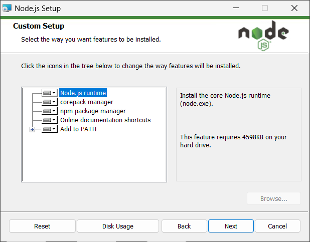
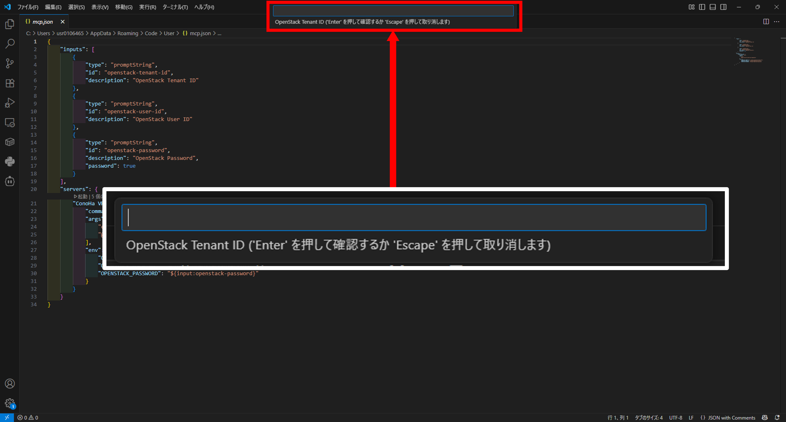

# npm パッケージインストール版実行ガイド

## 目次

- [npm パッケージインストール版実行ガイド](#npm-パッケージインストール版実行ガイド)
  - [目次](#目次)
  - [前提条件](#前提条件)
  - [AIエージェント別実行方法](#aiエージェント別実行方法)
    - [Cursor](#cursor)
      - [1. mcp.jsonに設定を記述](#1-mcpjsonに設定を記述)
      - [2. 設定値の確認](#2-設定値の確認)
      - [3. MCPサーバーの起動](#3-mcpサーバーの起動)
      - [4. ツールの使用](#4-ツールの使用)
    - [GitHub Copilot (VSCode)](#github-copilot-vscode)
      - [1. 設定の追加](#1-設定の追加)
      - [2. 設定値の確認](#2-設定値の確認)
      - [3. MCPサーバーの起動](#3-mcpサーバーの起動)
      - [4. ツールの使用](#4-ツールの使用)
    - [GitHub Copilot (CLI)](#github-copilot-cli)
      - [1. 設定の追加](#1-設定の追加-1)
      - [2. サーバーの利用](#2-サーバーの利用)
    - [Codex CLI](#codex-cli)
      - [1. config.tomlに設定を記述](#1-configtomlに設定を記述)
      - [2. サーバーの利用](#2-サーバーの利用-1)
    - [Cline (VSCode)](#cline-vscode)
      - [1. VSCodeにおけるClineのインストール](#1-vscodeにおけるclineのインストール)
      - [2. Clineの設定の追加](#2-clineの設定の追加)
      - [3. 設定値の確認](#3-設定値の確認)
      - [4. ツールの使用](#4-ツールの使用-1)
  - [トラブルシューティング](#トラブルシューティング)
    - [よくある問題](#よくある問題)

このドキュメントでは、**npm パッケージ**によりConoHa VPS MCPを実行する方法を説明します。

**⚠️ 注意:** GitHub Packages から npm registry へ移行しました。以前からご利用の方は .npmrc ファイルの設定にご注意ください。

## 前提条件

**Node.js v20以上**・**npm v9.6.4 以上**（Node.jsに付属）のインストール

<details>
<summary>Node.jsのインストール手順（Windows向け）</summary>

1. Node.jsのダウンロードページにアクセスします [ダウンロードページ](https://nodejs.org/ja/download)
2. アーキテクチャーとOSを確認したうえで、ダウンロードページ下部にある「Windows インストーラー（.msi）」をクリックします
   
    

3. ダウンロードされたインストーラー（.msi）をダブルクリックします
4. しばらく待つとSetup Wizardが表示されるので、Nextを押します

    

5. ライセンス規約を一読したうえで同意（チェックを入力）をして、Nextを押します

    

6. 表示されているインストール先に問題がなければNextを押します（基本的にはデフォルトのままで問題ありません）

    

7. 追加でインストールするものがない場合は基本的に何も選択せず、Nextを押します（ConoHa VPS MCP Serverでは追加でインストールが必要なものはありません）

    

8. こちらも追加でインストールするものがない場合はチェックを入れず、Nextを押します（ConoHa VPS MCP Serverでは追加でインストールが必要なものはありません）

    

9.  Installボタンをクリックします

    

10.  インストールが完了したらFinishを押します

</details>

## AIエージェント別実行方法

  | Cursor | VS Code |
  |:------:|:-------:|
  | [](https://cursor.com/ja/install-mcp?name=ConoHa%20VPS%20MCP&config=eyJlbnYiOnsiT1BFTlNUQUNLX1RFTkFOVF9JRCI6IiIsIk9QRU5TVEFDS19VU0VSX0lEIjoiIiwiT1BFTlNUQUNLX1BBU1NXT1JEIjoiIn0sImNvbW1hbmQiOiJucG0gZXhlYyBAZ21vLWludGVybmV0L2Nvbm9oYS12cHMtbWNwQGxhdGVzdCJ9) | [](https://insiders.vscode.dev/redirect/mcp/install?name=ConoHa%20VPS%20MCP&config=%7B%22command%22%3A%22npm%22%2C%22args%22%3A%5B%22exec%22%2C%22%40gmo-internet%2Fconoha-vps-mcp%40latest%22%5D%2C%22env%22%3A%7B%22OPENSTACK_TENANT_ID%22%3A%22%22%2C%22OPENSTACK_USER_ID%22%3A%22%22%2C%22OPENSTACK_PASSWORD%22%3A%22%22%7D%2C%22type%22%3A%22stdio%22%7D) |
  
### Cursor

<details>
<summary>セットアップ手順</summary>

#### 1. mcp.jsonに設定を記述
mcp.jsonに以下の設定を追加します：
```json
{
  "mcpServers": {
    "ConoHa VPS MCP": {
      "command": "npm",
      "args": [
          "exec",
          "@gmo-internet/conoha-vps-mcp@latest"
        ],
      "env": {
        "OPENSTACK_TENANT_ID": "YOUR_OPENSTACK_TENANT_ID",
        "OPENSTACK_USER_ID": "YOUR_OPENSTACK_USER_ID",
        "OPENSTACK_PASSWORD": "YOUR_OPENSTACK_PASSWORD"
      }
    }
  }
}
```

##### mcp.jsonの設置場所

特定のプロジェクト専用のツールとして設定する場合
```txt
使用するプロジェクト内に以下のディレクトリ、ファイルを作成
.cursor/mcp.json
```

どこからでも使えるツールとして設定する場合
```txt
~/.cursor/mcp.json
```

#### 2. 設定値の確認

- `PATH_TO_DIRECTORY`: プロジェクトのディレクトリパスに置き換えてください
- 環境変数の設定値：

```txt
OPENSTACK_TENANT_ID: テナントID
OPENSTACK_USER_ID: APIユーザーのユーザーID
OPENSTACK_PASSWORD: APIユーザーのパスワード
```

各値はConoHaコントロールパネルのAPI設定で確認できます。


*https://manage.conoha.jp/V3/API/*

#### 3. MCPサーバーの起動

mcp.jsonを設定後、設定内容に問題がない場合は自動的に起動します。

#### 4. ツールの使用

1. チャット欄左下の切り替えメニューから**Agent**モードを選択します

2. プロンプトを入力して操作を実行します

   [サンプルプロンプト](../README.md#-使用例)

</details>

### GitHub Copilot (VSCode)

<details>
<summary>セットアップ手順</summary>

#### 1. 設定の追加

1. VSCode上の画面で`ctrl + Shift + P`を実行してコマンドパレットを開きます

2. 上部の検索窓で`Open User Configuration`と入力します（大文字小文字は区別しません）

   

3. 「MCP: ユーザー構成を開く」をクリックします

  

4. 開いたmcp.jsonに以下の設定を追加します：

```json
{
    "inputs": [
      {
        "type": "promptString",
        "id": "openstack-tenant-id",
        "description": "OpenStack Tenant ID"
      },
      {
        "type": "promptString",
        "id": "openstack-user-id",
        "description": "OpenStack User ID"
      },
      {
        "type": "promptString",
        "id": "openstack-password",
        "description": "OpenStack Password",
        "password": true
      }
    ],
    "servers": {
      "ConoHa VPS MCP": {
        "command": "npm",
        "args": [
          "exec",
          "@gmo-internet/conoha-vps-mcp@latest"
        ],
        "env": {
          "OPENSTACK_TENANT_ID": "${input:openstack-tenant-id}",
          "OPENSTACK_USER_ID": "${input:openstack-user-id}",
          "OPENSTACK_PASSWORD": "${input:openstack-password}"
        }
      }
    }
}
```

#### 2. 設定値の確認

- 環境変数の設定値：

```txt
OPENSTACK_TENANT_ID: テナントID
OPENSTACK_USER_ID: APIユーザーのユーザーID
OPENSTACK_PASSWORD: APIユーザーのパスワード
```

各値はConoHaコントロールパネルのAPI設定で確認できます。


*https://manage.conoha.jp/V3/API/*

#### 3. MCPサーバーの起動

編集したjsonファイル上に表示される起動ボタンをクリックして、MCPサーバーを起動します。その際、環境変数の初期設定を求められるので、確認した設定値を入力してください。


> 📌
> 環境変数の入力欄は起動ボタンをクリックした後に、画面上部に表示されます。
> 
> 

#### 4. ツールの使用

1. GitHub Copilotを起動します
   - **Windows/Linux**: `Ctrl + Shift + I`
   - **Mac**: `Command + Shift + I`

2. チャット欄のドロップダウンメニューから**Agent**モードを選択します

3. チャット欄の**ツール**ボタンをクリックして、**MCPサーバー：ConoHa VPS MCP**を選択します

  

4. プロンプトを入力して操作を実行します

   [サンプルプロンプト](../README.md#-使用例)

</details>

### GitHub Copilot (CLI)
<details>
<summary>セットアップ手順</summary>

GitHub Copilot (CLI)のインストール方法や起動方法などは、下記の公式ドキュメントを参照してください。
[インストール方法]("https://docs.github.com/ja/copilot/how-tos/set-up/install-copilot-cli")
[起動方法]("https://docs.github.com/ja/copilot/how-tos/use-copilot-agents/use-copilot-cli")

#### 1. 設定の追加
GitHub Copilot (CLI)を起動させて、以下のコマンドを入力します。

```
/mcp add
```

コマンドを入力して実行後、MCPサーバーの実行に必要な情報を入力する欄が出力されます。
それぞれの項目では以下のように入力してください。

**Server Name:**

この項目では、ユーザー自身が識別できる名前であれば任意の名前を入力することができます。
ただし英数字、アンダースコア、ハイフンのみを入力することができます（空白などを含めることはできません）。
```
例：ConoHa-VPS-MCP
```

**Server Type:**
```
[1] Local
```

**Command:**
```
npm exec @gmo-internet/conoha-vps-mcp@latest
```

**Environment Variables:**
```
OPENSTACK_TENANT_ID=YOUR_OPENSTACK_TENANT_ID, OPENSTACK_USER_ID=YOUR_OPENSTACK_USER_ID, OPENSTACK_PASSWORD=YOUR_OPENSTACK_PASSWORD
```
それぞれの環境変数の設定値：

```txt
OPENSTACK_TENANT_ID: テナントID
OPENSTACK_USER_ID: APIユーザーのユーザーID
OPENSTACK_PASSWORD: APIユーザーのパスワード
```

各値はConoHaコントロールパネルのAPI設定で確認できます。


*https://manage.conoha.jp/V3/API/*

**Tools**
すべてのtoolを使用したい場合は``*``を、使用したいtoolを指定したい場合はカンマ区切りでtool名を入力してください（デフォルト値は``*``）

[tool一覧](./tool.md)

以上の入力が完了したら、``ctrl`` + ``s``で登録情報を保存します。
``MCP configuration saved successfully! Changes will take effect immediately.``というメッセージが出力されたら``q``キーを押して終了させます。

#### 2. サーバーの利用
プロンプトを入力して操作を実行します。
[サンプルプロンプト](../README.md#-使用例)

</details>

### Codex CLI

<details>
<summary>セットアップ手順</summary>

Codex CLIのインストール方法や起動方法などは、下記の公式ドキュメントを参照してください。
[インストール/起動方法](https://github.com/openai/codex/blob/main/README.md)

#### 1. config.tomlに設定を記述
config.tomlに以下の設定を追加します：

```
[mcp_servers.conoha_vps_mcp]
command = "npm"
args = ["exec", "@gmo-internet/conoha-vps-mcp@latest"]

[mcp_servers.conoha_vps_mcp.env]
OPENSTACK_TENANT_ID = YOUR_OPENSTACK_TENANT_ID
OPENSTACK_USER_ID = YOUR_OPENSTACK_USER_ID
OPENSTACK_PASSWORD = YOUR_OPENSTACK_PASSWORD
```

config.tomlの場所：``~/.codex/config.toml``

初めてMCPサーバーを追加する場合などはconfig.tomlが作成されていない場合があります。
その際はご自身でconfig.tomlを作成してください。

それぞれの環境変数の設定値：

```txt
OPENSTACK_TENANT_ID: テナントID
OPENSTACK_USER_ID: APIユーザーのユーザーID
OPENSTACK_PASSWORD: APIユーザーのパスワード
```

各値はConoHaコントロールパネルのAPI設定で確認できます。


*https://manage.conoha.jp/V3/API/*

#### 2. サーバーの利用
プロンプトを入力して操作を実行します。
[サンプルプロンプト](../README.md#-使用例)


</details>

### Cline (VSCode)

<details>
<summary>セットアップ手順</summary>

#### 1. VSCodeにおけるClineのインストール

1. VSCode左側の拡張機能メニューを開きます

   

2. 上部の検索窓で「cline」と検索し、Clineをインストールします

   

#### 2. Clineの設定の追加

1. VSCode左側のClineメニューを開き、適切なプランを選択するとMCPサーバーアイコンが表示されるため、これをクリックします

   

2. 歯車アイコンから設定を開き、 **[Configure MCP Servers]** をクリックします

   

3. `cline_mcp_settings.json`に以下の設定を追加します：

```json
{
  "mcpServers": {
    "ConoHa VPS MCP": {
      "command": "npm",
      "args": [
        "exec",
        "@gmo-internet/conoha-vps-mcp@latest"
      ],
      "env": {
        "OPENSTACK_TENANT_ID": "YOUR_OPENSTACK_TENANT_ID", // ここにテナントIDを入力
        "OPENSTACK_USER_ID": "YOUR_OPENSTACK_USER_ID", // ここにユーザーIDを入力
        "OPENSTACK_PASSWORD": "YOUR_OPENSTACK_PASSWORD" // ここにパスワードを入力
      }
    }
  }
}
```

#### 3. 設定値の確認

- 環境変数の設定値：

```txt
OPENSTACK_TENANT_ID: テナントID
OPENSTACK_USER_ID: APIユーザーのユーザーID
OPENSTACK_PASSWORD: APIユーザーのパスワード
```

各値はConoHaコントロールパネルのAPI設定で確認できます。


#### 4. ツールの使用

1. チャット欄右下の切り替えメニューから**Act**モードを選択します

2. プロンプトを入力して操作を実行します

   [サンプルプロンプト](../README.md#-使用例)

</details>

## トラブルシューティング

### よくある問題

- **認証エラー**: 環境変数の値が正しく設定されているか確認してください
- **Node.jsバージョンエラー**: Node.js v20以上がインストールされているか確認してください
- **起動エラー**: `@gmo-internet/conoha-vps-mcp@latest` のパッケージ名が正しいかを確認してください
- **パッケージ取得エラー**: `npm exec`の初回実行時にパッケージのダウンロードに時間がかかる場合があります
- その他FAQは[こちら](FAQ.md)

**💡 ヒント:** 問題が解決しない場合は、[GitHub Issues](https://github.com/gmo-internet/conoha_vps_mcp/issues)でお気軽にお問い合わせください。
